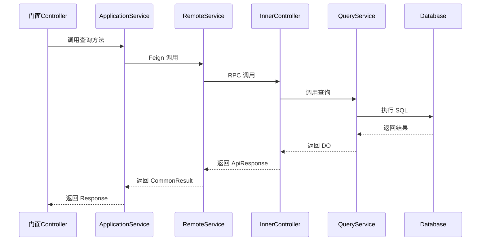

# 技术规格书生成 Skill

> **职责**：基于需求澄清结果，生成结构化的技术规格文档（tech-spec.md），作为后续代码生成的唯一可信源。

---

## 触发条件

- 用户指令："生成技术规格书"、"设计 SPEC"、"生成 tech-spec"
- 进入 feature-implementation 流程的 plan 阶段
- 前置条件：clarified_interfaces、clarified_data_model、clarified_business_rules 已完成

---

## 前置依赖（必须读取）

| 文件 | 路径 | 说明 |
|------|------|------|
| 门面服务规范 | `.qoder/rules/code-generation/01-facade-service.md` | Controller、ApplicationService、DTO 规范 |
| 应用服务规范 | `.qoder/rules/code-generation/02-inner-service.md` | InnerController、Query/ManageService 规范 |
| Feign 接口规范 | `.qoder/rules/code-generation/03-feign-interface.md` | RemoteService、ApiRequest/ApiResponse 规范 |
| 命名规范 | `.qoder/rules/code-generation/04-naming-standards.md` | 对象命名、Service/Controller 命名规范 |
| 数据库规范 | `.qoder/rules/code-generation/05-database-standards.md` | 表命名、DO 实体、字段类型映射 |
| 错误码规范 | `.qoder/rules/code-generation/06-error-code-standards.md` | 错误码格式、系统/模块代码定义 |
| 数据访问规范 | `.qoder/rules/code-generation/07-data-access-standards.md` | MyBatis-Plus 使用、Query/ManageService 规范 |
| 服务层规范 | `.qoder/rules/code-generation/08-service-layer-standards.md` | 异常处理、参数注解、日志、操作人 ID |
| 目录结构规范 | `.qoder/rules/code-generation/09-directory-structure.md` | 包路径、目录结构、文件命名 |
| **规格生成约束** | `.qoder/rules/code-generation/12-spec-generation-constraints.md` | **DoD 约束前置到规格生成阶段** |

---

## 输入

| 输入项 | 类型 | 说明 |
|--------|------|------|
| feature_definition | object | Feature 基本信息（ID、名称、描述等） |
| clarified_interfaces | object | 澄清后的接口设计（内部接口 + 门面接口） |
| clarified_data_model | object | 澄清后的数据模型（表结构、字段、索引） |
| clarified_business_rules | object | 澄清后的业务规则（校验、状态流转） |
| layer_implementation_order | array | 分层实现顺序 |
| code_generation_strategy | object | 代码生成策略 |

---

## 输出

| 输出项 | 路径 | 说明 |
|--------|------|------|
| tech_spec_draft | `workspace/outputs/tech-spec-draft.md` | 技术规格书草稿（Markdown 格式） |

---

## 工作流程

### 步骤 1：读取规范和模板

1. 读取所有前置依赖的规范文件
2. 读取 tech-spec.yml 模板
3. 理解代码生成规范中的约束（命名、分层、参数校验等）

### 步骤 2：整合澄清结果

将澄清阶段的结果整合为结构化数据：

**2.1 接口定义整合**
- 内部服务接口（Feign）：路径、方法、请求/响应类
- 门面服务接口：路径、方法、请求/响应类
- 确保接口命名符合规范（禁止 @PathVariable，使用 @RequestParam）

**2.2 数据模型整合**
- 表结构：字段名、类型、长度、约束、默认值、注释
- 索引：索引名、字段、类型
- 测试数据：每个表至少 3 条典型数据

**2.3 业务规则整合**
- 字段校验规则
- 状态流转规则（如有）

### 步骤 3：生成实现计划

基于服务分层和代码生成策略，生成文件清单：

```yaml
implementation:
  layer_order: [application, facade]
  files:
    - path: {inner-api-service}/feign/{Name}RemoteService.java
      type: feign
      service: {inner-api-service}
      
    - path: {app-service}/controller/inner/{Name}InnerController.java
      type: controller
      service: {app-service}
      layer: application
      
    - path: {facade-service}/controller/admin/{Name}AdminController.java
      type: controller
      service: {facade-service}
      layer: facade
```

### 步骤 4：应用规范约束

基于 `12-spec-generation-constraints.md` 应用 DoD 约束到规格定义：

**4.1 接口定义约束应用**
- 自动根据服务分层确定路径前缀（/admin/api/v1/、/inner/api/v1/）
- 自动根据命名规范生成 Controller 类名
- 自动确定参数校验方式（@Valid vs 手动校验）
- 自动确定 HTTP 方法（GET/POST/PUT/DELETE）

**4.2 DTO 命名约束应用**
- 自动根据分层确定 DTO 后缀（Request/Response vs ApiRequest/ApiResponse）
- 自动添加 `operatorId` 字段到写操作的 ApiRequest
- 自动添加必要的注解（@JsonFormat、@Valid 等）

**4.3 Service 分层约束应用**
- 自动根据操作类型确定 Service 类型（Query vs Manage）
- 自动确定 ApplicationService 的分层归属

**4.4 数据模型约束应用**
- 自动根据表名生成 DO 类名（aim_xxx → Aim{Name}DO）
- 自动添加基础字段（id, createTime, updateTime）
- 自动根据删除策略确定删除字段

### 步骤 5：生成时序图（Mermaid 格式）

基于接口定义和调用关系，生成 Mermaid 时序图，**内嵌在 tech-spec.md 中**：

**5.1 查询类接口时序图**


**5.2 写操作接口时序图**
- 展示从门面 Controller 到 ManageService 的完整调用链
- 包含 operatorId 解析和传递
- 标注事务边界（@Transactional）

**5.3 跨服务依赖时序图**
- 当 Feature 涉及跨服务调用时生成
- 展示服务间的 Feign 调用关系

**5.4 业务流程图**
- 针对复杂业务场景（如状态机、审批流程）
- 使用 Mermaid flowchart 展示业务处理流程

### 步骤 6：生成 tech-spec-draft.md

基于模板生成完整的 Markdown 格式技术规格书：

```markdown
# Feature 技术规格书: {Feature 名称}

## 1. Feature 基本信息
- ID、名称、领域、模块、优先级、描述

## 2. 接口定义

### 2.1 内部服务接口（Feign）
- 完整的方法签名、路径、DTO

### 2.2 门面服务接口
- 完整的方法签名、路径、DTO

## 3. 数据模型

### 3.1 数据库表结构
- 字段详细定义

### 3.2 测试数据

## 4. 业务规则

### 4.1 校验规则

### 4.2 状态流转（如有）

## 5. 调用时序图

### 5.1 查询类接口时序图
```mermaid
sequenceDiagram
    ...
```

### 5.2 写操作接口时序图
```mermaid
sequenceDiagram
    ...
```

## 6. 业务流程图


## 7. 实现计划
- 分层顺序
- 文件清单
```

### 步骤 7：自检

生成完成后进行自检：

**完整性检查**：
- [ ] 所有澄清的接口都已定义
- [ ] 所有澄清的表都已定义
- [ ] 所有字段都有类型和约束
- [ ] 测试数据已生成
- [ ] 时序图已生成（查询/写操作/跨服务依赖）
- [ ] 业务流程图已生成（如需要）

**规范性检查**：
- [ ] 接口路径符合规范（/inner/api/v1/ 或 /admin/api/v1/）
- [ ] DTO 命名符合规范（{Name}Request/{Name}Response/{Name}ApiRequest/{Name}ApiResponse）
- [ ] 表名符合规范（aim_{模块}_{业务名}）
- [ ] 时序图符合 Mermaid 语法，展示完整调用链路

**规范合规性检查（基于 12-spec-generation-constraints.md）**：
- [ ] Controller 命名符合规范（AdminController/InnerController）
- [ ] 路径前缀正确（/admin/api/v1/、/inner/api/v1/）
- [ ] 参数校验方式正确（@Valid vs 手动校验）
- [ ] DTO 命名和字段符合分层规范
- [ ] Service 分层清晰（Query/Manage/Application）
- [ ] DO 实体命名和字段符合规范
- [ ] 数据库表名和字段符合规范

---

## 返回格式

```
状态：已完成
产出：workspace/outputs/tech-spec-draft.md
说明：技术规格书草稿已生成（Markdown 格式，内嵌时序图和业务流程图）
下一步：用户确认后生成最终 tech-spec.md
```

---

## 相关文档

- 流程定义：`orchestrator/WORKFLOWS/feature-implementation/workflow.yml`
- 代码生成规范：`.qoder/rules/code-generation/`
- **规格生成约束**：`.qoder/rules/code-generation/12-spec-generation-constraints.md`
