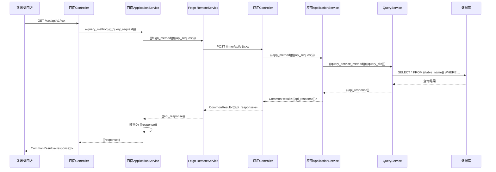
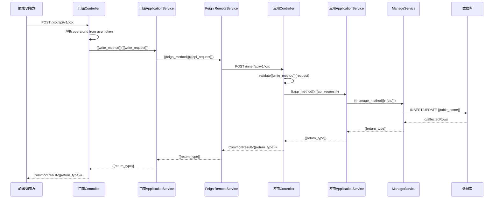
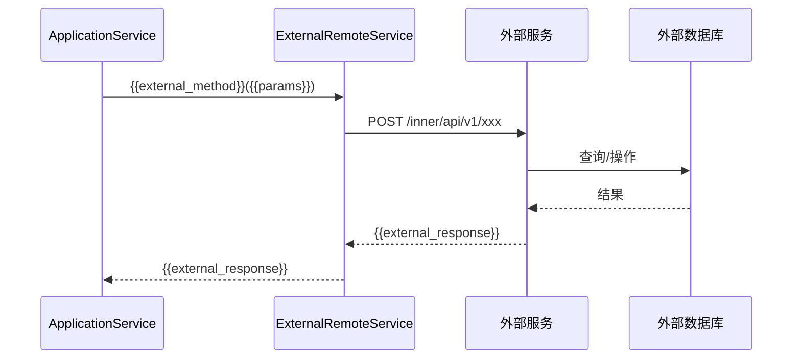

# {{feature_id}} {{feature_name}} - 调用时序图

## 1. 查询类接口时序图（{{query_api_name}}）

## 2. 写操作接口时序图（{{write_api_name}}）

## 3. 跨服务依赖时序图（如有）

## 4. 特定业务时序图（根据Feature场景补充）

> 根据实际业务场景，补充以下类型的时序图：
> - 状态机流转图（如有状态变更）
> - 复杂校验链时序图（如有多步骤校验）
> - 批量操作时序图（如有批量导入）
> - 异步处理时序图（如有异步任务）
