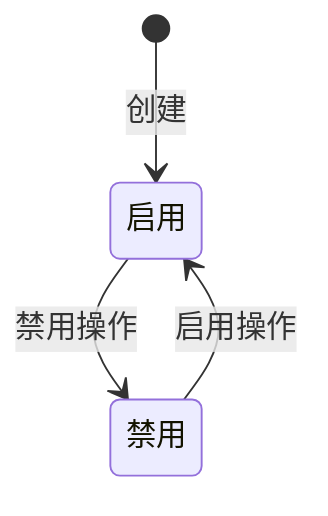
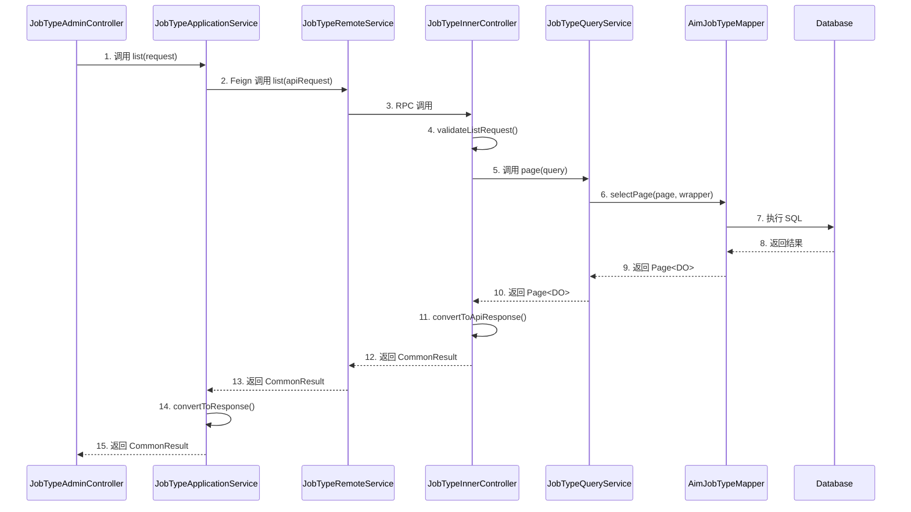
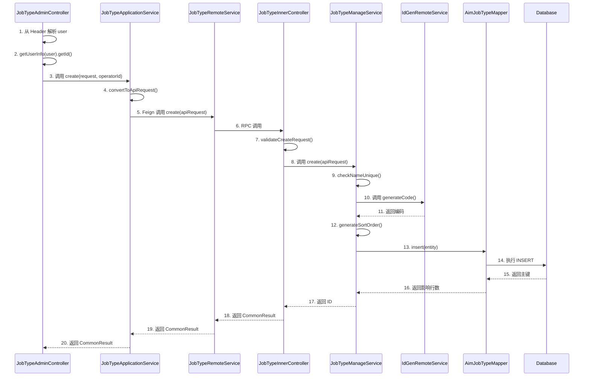
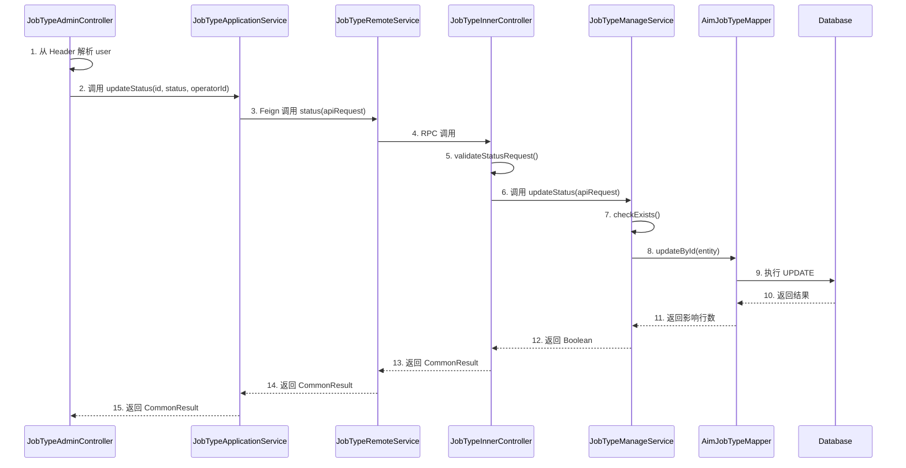
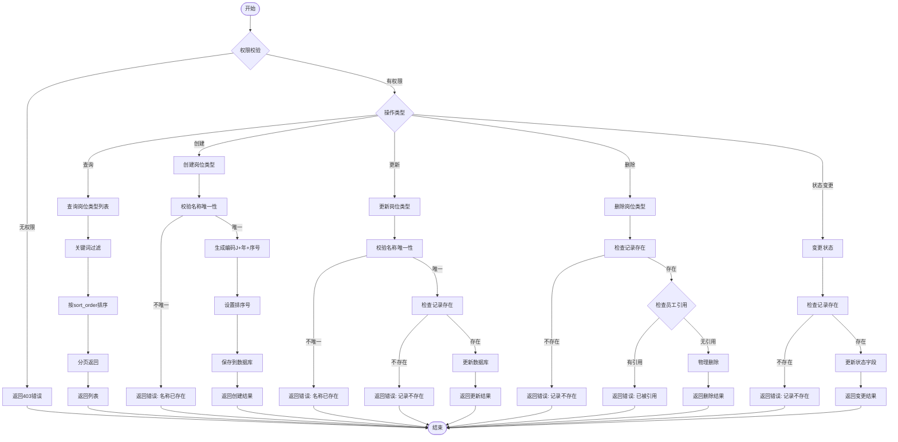

# Feature 技术规格书: F-001 岗位类型管理

> **Feature ID**: F-001  
> **所属模块**: mall-agent-employee-service  
> **优先级**: P0  
> **状态**: completed  
> **生成时间**: 2026-03-15

---

## 1. Feature 基本信息

| 属性 | 值 |
|------|-----|
| ID | F-001 |
| 名称 | 岗位类型管理 |
| 领域 | 配置管理域 |
| 模块 | mall-agent-employee-service |
| 优先级 | P0 |
| 描述 | 运营人员管理智能员工岗位类型，支持增删改查及启用禁用 |

---

## 2. 接口定义

### 2.1 内部服务接口 (Feign)

| 接口名称 | 路径 | 方法 | 请求 | 响应 | 说明 |
|---------|------|------|------|------|------|
| list | `/inner/api/v1/job-types/list` | POST | `JobTypePageApiRequest` | `CommonResult.PageData<JobTypeApiResponse>` | 岗位类型分页列表 |
| create | `/inner/api/v1/job-types/create` | POST | `JobTypeCreateApiRequest` | `CommonResult<Long>` | 创建岗位类型 |
| update | `/inner/api/v1/job-types/update` | PUT | `JobTypeUpdateApiRequest` | `CommonResult<Boolean>` | 更新岗位类型 |
| updateStatus | `/inner/api/v1/job-types/status` | PUT | `JobTypeStatusApiRequest` | `CommonResult<Boolean>` | 状态变更（启用/禁用） |
| delete | `/inner/api/v1/job-types/delete` | DELETE | `Long id` | `CommonResult<Boolean>` | 删除岗位类型 |

### 2.2 门面服务接口

| 接口名称 | 路径 | 方法 | 请求 | 响应 | 说明 |
|---------|------|------|------|------|------|
| list | `/admin/api/v1/job-types` | GET | `JobTypeListRequest` | `CommonResult.PageData<JobTypeResponse>` | 岗位类型列表（分页+关键词搜索） |
| create | `/admin/api/v1/job-types` | POST | `JobTypeCreateRequest` | `CommonResult<JobTypeResponse>` | 新增岗位类型 |
| update | `/admin/api/v1/job-types/{jobTypeId}` | PUT | `JobTypeUpdateRequest` | `CommonResult<JobTypeResponse>` | 编辑岗位类型 |
| updateStatus | `/admin/api/v1/job-types/{jobTypeId}/status` | PUT | `JobTypeStatusRequest` | `CommonResult<Void>` | 启用/禁用岗位类型 |

---

## 3. 数据模型

### 3.1 数据库表: aim_agent_job_type

| 字段名 | 类型 | 长度 | 可空 | 默认值 | 注释 |
|--------|------|------|------|--------|------|
| id | BIGINT | - | NO | AUTO_INCREMENT | 主键ID |
| name | VARCHAR | 64 | NO | - | 岗位类型名称 |
| code | VARCHAR | 32 | NO | - | 岗位类型编码（系统自动生成） |
| description | VARCHAR | 255 | YES | - | 岗位描述 |
| status | TINYINT | - | NO | 1 | 状态：0-禁用 1-启用 |
| sort_order | INT | - | NO | 0 | 排序号 |
| create_time | DATETIME | - | NO | CURRENT_TIMESTAMP | 创建时间 |
| update_time | DATETIME | - | NO | CURRENT_TIMESTAMP | 更新时间 |
| creator_id | BIGINT | - | YES | - | 创建人ID |
| updater_id | BIGINT | - | YES | - | 更新人ID |

**索引**:

| 索引名 | 字段 | 类型 |
|--------|------|------|
| uk_code | code | UNIQUE |
| idx_status | status | INDEX |
| idx_sort_order | sort_order | INDEX |

**删除策略**: 物理删除

---

## 4. 业务规则

### 4.1 字段校验规则

| 字段 | 规则 | 错误信息 | 错误码 |
|------|------|----------|--------|
| name | required | 岗位类型名称不能为空 | 10091002 |
| name | length(1,64) | 岗位类型名称长度为1-64字符 | 10091002 |
| code | unique | 岗位类型编码已存在 | 10092001 |
| status | in(0,1) | 状态值无效 | 10091001 |

### 4.2 状态流转

### 4.3 编码生成规则

- **格式**: J + yyyy + 6位序号
- **服务**: IdGenRemoteService (mall-basic)
- **错误码**: 10095002

### 4.4 排序策略

- **策略**: 创建时自动设置为当前最大值 + 1
- **查询排序**: 按 sort_order ASC 排序

---

## 5. 调用时序图

### 5.1 查询类接口时序图 (list)

### 5.2 写操作接口时序图 (create)

### 5.3 状态变更时序图 (updateStatus)

---

## 6. 业务流程图

### 6.1 岗位类型管理流程

---

## 7. 实现计划

### 7.1 分层实现顺序

1. **database**: 数据库表创建
2. **api**: Feign 接口 DTO 定义
3. **application**: 应用服务层实现
4. **facade**: 门面服务层实现

### 7.2 文件清单

| 文件路径 | 类型 | 服务 | 分层 |
|---------|------|------|------|
| `outputs/schemas/aim_agent_job_type/init-schema.sql` | SQL | mall-agent-employee-service | database |
| `mall-inner-api/.../request/JobTypePageApiRequest.java` | DTO | mall-inner-api | api |
| `mall-inner-api/.../request/JobTypeCreateApiRequest.java` | DTO | mall-inner-api | api |
| `mall-inner-api/.../response/JobTypeApiResponse.java` | DTO | mall-inner-api | api |
| `mall-inner-api/.../feign/JobTypeRemoteService.java` | Feign | mall-inner-api | api |
| `mall-agent-employee-service/.../entity/AimJobTypeDO.java` | Entity | mall-agent-employee-service | application |
| `mall-agent-employee-service/.../service/JobTypeQueryService.java` | Service | mall-agent-employee-service | application |
| `mall-agent-employee-service/.../service/JobTypeManageService.java` | Service | mall-agent-employee-service | application |
| `mall-agent-employee-service/.../controller/inner/JobTypeInnerController.java` | Controller | mall-agent-employee-service | application |
| `mall-admin/.../controller/agent/JobTypeAdminController.java` | Controller | mall-admin | facade |
| `mall-admin/.../dto/request/agent/JobTypeCreateRequest.java` | DTO | mall-admin | facade |
| `mall-admin/.../dto/response/agent/JobTypeResponse.java` | DTO | mall-admin | facade |

---

## 8. 验收标准

### 8.1 功能验收

| ID | 验收项 | 验证方法 | 状态 |
|----|--------|----------|------|
| f01 | 支持岗位类型 CRUD 操作 | HTTP接口测试 | completed |
| f02 | 返回该岗位下关联员工数 | 列表接口验证 | pending |
| f03 | 启用/禁用状态正确联动 | 状态变更测试 | completed |
| f04 | 接口返回符合CommonResult规范 | 响应格式检查 | completed |
| f05 | 编码由系统自动生成（格式J+年+6位序号） | 创建接口验证 | completed |
| f06 | 排序号后台自动生成（最大值+1） | 创建接口验证 | completed |

### 8.2 非功能验收

| ID | 验收项 | 验证方法 | 状态 |
|----|--------|----------|------|
| nf01 | 列表查询响应时间 ≤ 1s | 性能测试 | completed |

### 8.3 代码质量

| ID | 验收项 | 验证方法 | 状态 |
|----|--------|----------|------|
| cq-01 | 代码符合项目规范 | DoD检查卡 | completed |
| cq-02 | 无严重级别问题 | quality-report审查 | completed |
| cq-03 | 所有接口通过HTTP测试 | HTTP测试文件执行 | completed |

---

## 9. 依赖与风险

### 9.1 下游依赖

| Feature ID | 依赖类型 | 说明 |
|------------|----------|------|
| F-006 | strong | 员工申请审核需要查询岗位类型 |
| F-007 | weak | 解锁激活可能展示岗位信息 |
| F-008 | weak | 运营管理需要统计岗位下员工数 |

### 9.2 风险

| ID | 风险描述 | 缓解措施 | 状态 |
|----|----------|----------|------|
| r01 | 员工数量统计依赖 F-008 完成 | 当前返回0，待 F-008 完成后补充实现 | accepted |
| r02 | 删除时员工数量校验依赖 F-008 完成 | 当前跳过校验，待 F-008 完成后补充实现 | accepted |

---

## 10. 规范合规性检查

| 检查项 | 状态 | 说明 |
|--------|------|------|
| Controller 命名符合规范 | ✅ | JobTypeAdminController / JobTypeInnerController |
| 路径前缀正确 | ✅ | /admin/api/v1/ / /inner/api/v1/ |
| 参数校验方式正确 | ✅ | 门面层 @Valid，内部层手动校验 |
| DTO 命名和字段符合分层规范 | ✅ | Request/Response / ApiRequest/ApiResponse |
| Service 分层清晰 | ✅ | Query/Manage/Application 职责清晰 |
| DO 实体命名和字段符合规范 | ✅ | AimJobTypeDO |
| 数据库表名和字段符合规范 | ✅ | aim_agent_job_type |
