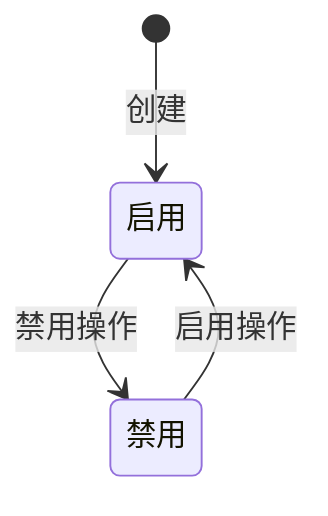
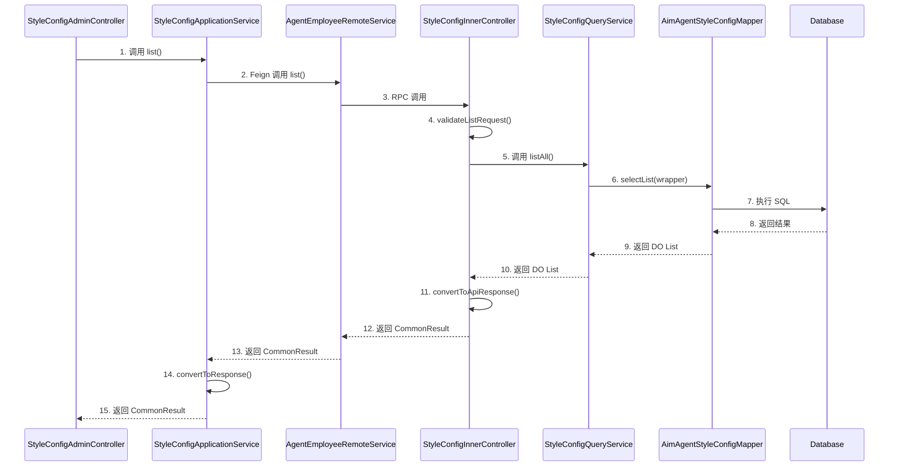
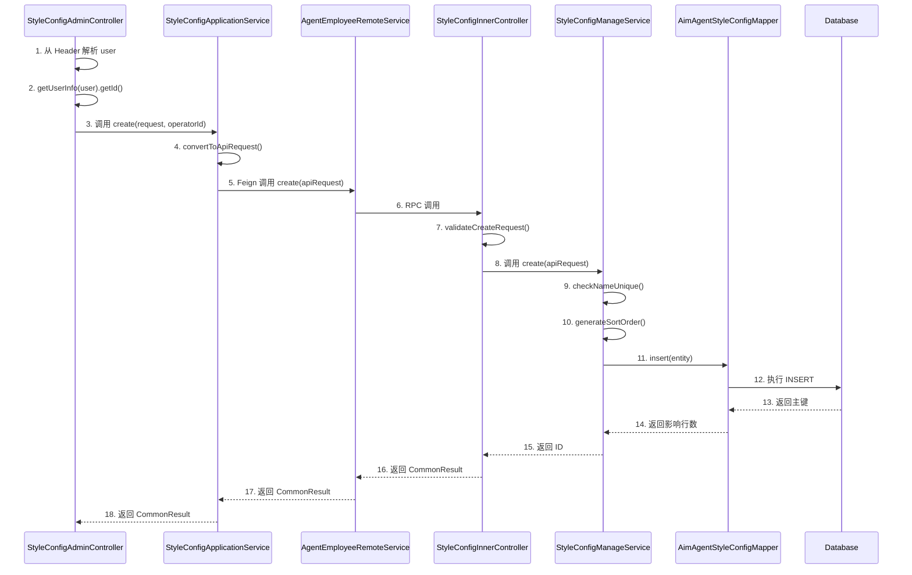
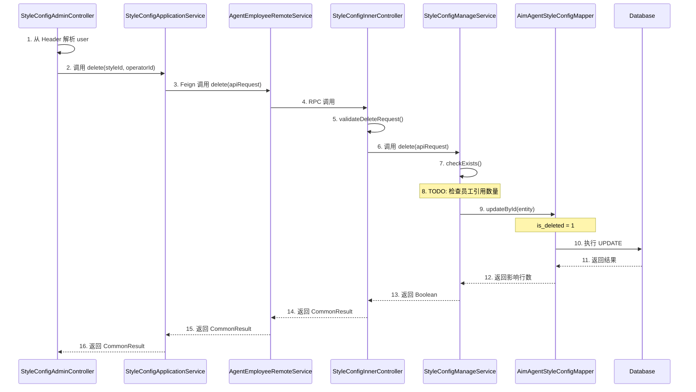
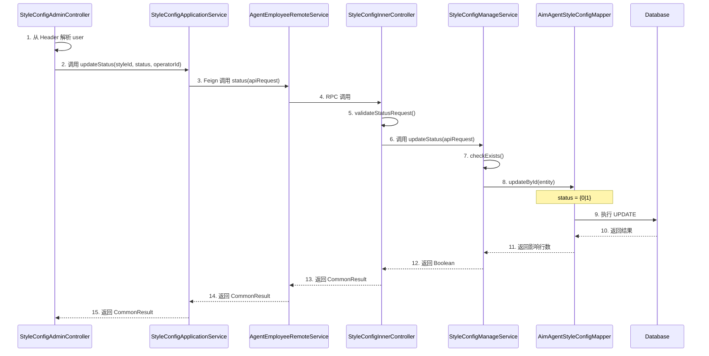
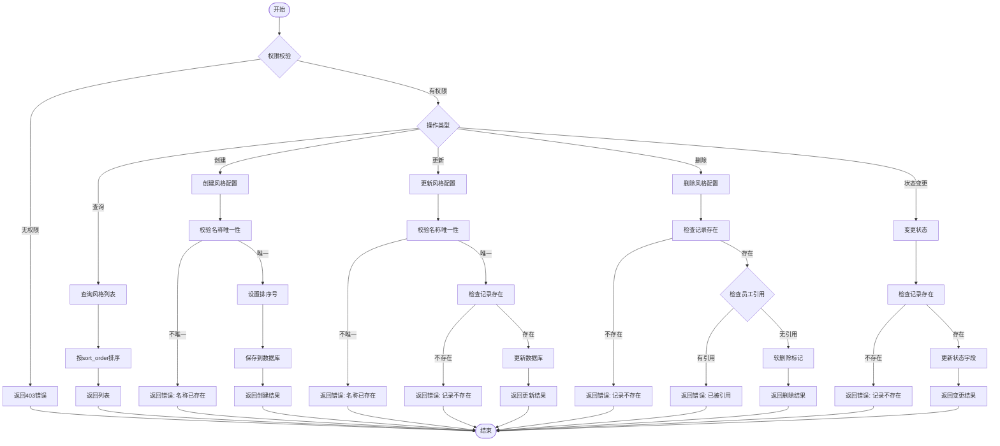

# Feature 技术规格书: F-002 人设风格管理

> **Feature ID**: F-002  
> **所属模块**: mall-agent-employee-service  
> **优先级**: P0  
> **状态**: completed  
> **生成时间**: 2026-03-15

---

## 1. Feature 基本信息

| 属性 | 值 |
|------|-----|
| ID | F-002 |
| 名称 | 人设风格管理 |
| 领域 | 配置管理域 |
| 模块 | mall-agent-employee-service |
| 优先级 | P0 |
| 描述 | 运营人员管理智能员工人设风格，支持增删改查及排序，软删除策略 |

---

## 2. 接口定义

### 2.1 内部服务接口 (Feign)

| 接口名称 | 路径 | 方法 | 请求 | 响应 | 说明 |
|---------|------|------|------|------|------|
| list | `/inner/api/v1/style-configs/list` | GET | 无参数 | `CommonResult<List<StyleConfigApiResponse>>` | 全量查询风格配置列表（按 sort_order ASC） |
| create | `/inner/api/v1/style-configs/create` | POST | `StyleConfigCreateApiRequest` | `CommonResult<Long>` | 创建风格配置 |
| update | `/inner/api/v1/style-configs/update` | POST | `StyleConfigUpdateApiRequest` | `CommonResult<Boolean>` | 更新风格配置 |
| delete | `/inner/api/v1/style-configs/delete` | POST | `StyleConfigDeleteApiRequest` | `CommonResult<Boolean>` | 删除风格配置（软删除） |
| status | `/inner/api/v1/style-configs/status` | POST | `StyleConfigStatusApiRequest` | `CommonResult<Boolean>` | 启用/禁用风格配置 |

**DTO 定义**:

```java
// StyleConfigCreateApiRequest
public class StyleConfigCreateApiRequest implements Serializable {
    private static final long serialVersionUID = -1L;
    
    @NotBlank(message = "风格名称不能为空")
    @Size(max = 64, message = "风格名称长度为1-64字符")
    private String name;
    
    @Size(max = 255)
    private String icon;
    
    @Size(max = 255)
    private String description;
    
    @Size(max = 500)
    private String promptPreview;
    
    @NotNull
    private Long operatorId;  // 操作人ID
}

// StyleConfigApiResponse
public class StyleConfigApiResponse implements Serializable {
    private static final long serialVersionUID = -1L;
    
    private Long id;
    private String name;
    private String icon;
    private String description;
    private String promptPreview;
    private Integer status;
    private Integer sortOrder;
    
    @JsonFormat(pattern = "yyyy-MM-dd HH:mm:ss", timezone = "GMT+8")
    private LocalDateTime createTime;
    
    @JsonFormat(pattern = "yyyy-MM-dd HH:mm:ss", timezone = "GMT+8")
    private LocalDateTime updateTime;
}
```

### 2.2 门面服务接口

| 接口名称 | 路径 | 方法 | 请求 | 响应 | 说明 |
|---------|------|------|------|------|------|
| list | `/admin/api/v1/style-configs` | GET | 无参数 | `CommonResult<List<StyleConfigResponse>>` | 人设风格列表（全量） |
| create | `/admin/api/v1/style-configs` | POST | `StyleConfigCreateRequest` | `CommonResult<StyleConfigResponse>` | 新增人设风格 |
| update | `/admin/api/v1/style-configs/{styleId}` | PUT | `StyleConfigUpdateRequest` | `CommonResult<StyleConfigResponse>` | 编辑人设风格 |
| status | `/admin/api/v1/style-configs/{styleId}/status` | PUT | `StyleConfigStatusRequest` | `CommonResult<Void>` | 启用/禁用人设风格 |
| delete | `/admin/api/v1/style-configs/{styleId}` | DELETE | 无参数 | `CommonResult<Void>` | 删除人设风格（有关联员工时不允许删除） |

**DTO 定义**:

```java
// StyleConfigCreateRequest
public class StyleConfigCreateRequest implements Serializable {
    private static final long serialVersionUID = -1L;
    
    @NotBlank(message = "风格名称不能为空")
    @Size(max = 64, message = "风格名称长度为1-64字符")
    private String name;
    
    @Size(max = 255)
    private String icon;
    
    @Size(max = 255)
    private String description;
    
    @Size(max = 500)
    private String promptPreview;
}

// StyleConfigResponse
public class StyleConfigResponse implements Serializable {
    private static final long serialVersionUID = -1L;
    
    private Long id;
    private String name;
    private String icon;
    private String description;
    private String promptPreview;
    private Integer status;
    private Integer sortOrder;
    
    @JsonFormat(pattern = "yyyy-MM-dd HH:mm:ss", timezone = "GMT+8")
    private LocalDateTime createTime;
    
    @JsonFormat(pattern = "yyyy-MM-dd HH:mm:ss", timezone = "GMT+8")
    private LocalDateTime updateTime;
}
```

---

## 3. 数据模型

### 3.1 数据库表: aim_agent_style_config

| 字段名 | 类型 | 长度 | 可空 | 默认值 | 注释 |
|--------|------|------|------|--------|------|
| id | BIGINT | - | NO | AUTO_INCREMENT | 主键ID |
| name | VARCHAR | 64 | NO | - | 风格名称 |
| icon | VARCHAR | 255 | YES | - | 风格图标URL |
| description | VARCHAR | 255 | YES | - | 风格描述 |
| prompt_preview | VARCHAR | 500 | YES | - | Prompt预览文本 |
| status | TINYINT | - | NO | 1 | 状态：0-禁用 1-启用 |
| sort_order | INT | - | NO | 0 | 排序号 |
| is_deleted | TINYINT | - | NO | 0 | 删除标记：0-未删除 1-已删除 |
| create_time | DATETIME | - | NO | CURRENT_TIMESTAMP | 创建时间 |
| update_time | DATETIME | - | NO | CURRENT_TIMESTAMP | 更新时间 |
| creator_id | BIGINT | - | YES | - | 创建人ID |
| updater_id | BIGINT | - | YES | - | 更新人ID |

**索引**:

| 索引名 | 字段 | 类型 |
|--------|------|------|
| uk_name | name | UNIQUE |
| idx_status | status | INDEX |
| idx_sort_order | sort_order | INDEX |

**删除策略**: 软删除（is_deleted 字段标记）

### 3.2 DO 实体: AimAgentStyleConfigDO

```java
@Data
@TableName("aim_agent_style_config")
public class AimAgentStyleConfigDO implements Serializable {
    private static final long serialVersionUID = -1L;
    
    @TableId(type = IdType.AUTO)
    private Long id;
    
    private String name;
    private String icon;
    private String description;
    private String promptPreview;
    private Integer status;
    private Integer sortOrder;
    private Integer isDeleted;
    private LocalDateTime createTime;
    private LocalDateTime updateTime;
    private Long creatorId;
    private Long updaterId;
}
```

---

## 4. 业务规则

### 4.1 字段校验规则

| 字段 | 规则 | 错误信息 | 错误码 |
|------|------|----------|--------|
| name | required | 风格名称不能为空 | 10091002 |
| name | length(1,64) | 风格名称长度为1-64字符 | 10091002 |
| name | unique | 风格名称已存在 | 10092001 |
| status | in(0,1) | 状态值无效 | 10091001 |

### 4.2 状态流转



| 从状态 | 到状态 | 触发条件 | 说明 |
|--------|--------|----------|------|
| null | 启用 | create | 创建时默认为启用状态 |
| 启用 | 禁用 | updateStatus(0) | 禁用操作 |
| 禁用 | 启用 | updateStatus(1) | 启用操作 |

### 4.3 软删除策略

- **策略**: 逻辑删除（is_deleted 字段标记）
- **删除检查**: 删除前检查是否被员工引用
  - 检查服务: `employeeRemoteService.countByStyleConfigId(id)`
  - 条件: 引用数量 == 0
  - 错误信息: "人设风格已被员工引用，无法删除"
  - **注意**: 当前版本跳过校验，待 F-006 完成后实现

### 4.4 排序策略

- **策略**: 创建时自动设置为当前最大值 + 1
- **查询排序**: 按 sort_order ASC 排序

---

## 5. 调用时序图

### 5.1 查询类接口时序图 (list)



### 5.2 写操作接口时序图 (create)



### 5.3 软删除时序图 (delete)



### 5.4 状态变更时序图 (status)



---

## 6. 业务流程图

### 6.1 风格配置管理流程



---

## 7. 实现计划

### 7.1 分层实现顺序

1. **database**: 数据库表创建
2. **api**: Feign 接口 DTO 定义
3. **application**: 应用服务层实现
4. **facade**: 门面服务层实现

### 7.2 文件清单

| 文件路径 | 类型 | 服务 | 分层 |
|---------|------|------|------|
| `outputs/schemas/aim_agent_style_config/init-schema.sql` | SQL | mall-agent-employee-service | database |
| `mall-inner-api/mall-agent-api/.../request/StyleConfigCreateApiRequest.java` | DTO | mall-inner-api | api |
| `mall-inner-api/mall-agent-api/.../request/StyleConfigUpdateApiRequest.java` | DTO | mall-inner-api | api |
| `mall-inner-api/mall-agent-api/.../request/StyleConfigStatusApiRequest.java` | DTO | mall-inner-api | api |
| `mall-inner-api/mall-agent-api/.../request/StyleConfigDeleteApiRequest.java` | DTO | mall-inner-api | api |
| `mall-inner-api/mall-agent-api/.../response/StyleConfigApiResponse.java` | DTO | mall-inner-api | api |
| `mall-agent-employee-service/.../entity/AimAgentStyleConfigDO.java` | Entity | mall-agent-employee-service | application |
| `mall-agent-employee-service/.../enums/StyleConfigStatusEnum.java` | Enum | mall-agent-employee-service | application |
| `mall-agent-employee-service/.../service/StyleConfigQueryService.java` | Service | mall-agent-employee-service | application |
| `mall-agent-employee-service/.../service/StyleConfigManageService.java` | Service | mall-agent-employee-service | application |
| `mall-agent-employee-service/.../service/StyleConfigApplicationService.java` | Service | mall-agent-employee-service | application |
| `mall-agent-employee-service/.../controller/inner/StyleConfigInnerController.java` | Controller | mall-agent-employee-service | application |
| `mall-admin/.../controller/agent/StyleConfigAdminController.java` | Controller | mall-admin | facade |
| `mall-admin/.../service/StyleConfigApplicationService.java` | Service | mall-admin | facade |
| `mall-admin/.../dto/request/agent/StyleConfigCreateRequest.java` | DTO | mall-admin | facade |
| `mall-admin/.../dto/request/agent/StyleConfigUpdateRequest.java` | DTO | mall-admin | facade |
| `mall-admin/.../dto/request/agent/StyleConfigStatusRequest.java` | DTO | mall-admin | facade |
| `mall-admin/.../dto/response/agent/StyleConfigResponse.java` | DTO | mall-admin | facade |
| `mall-agent-employee-service/src/test/http/StyleConfigInnerController.http` | HTTP Test | mall-agent-employee-service | test |
| `mall-admin/src/test/http/StyleConfigAdminController.http` | HTTP Test | mall-admin | test |

---

## 8. 验收标准

### 8.1 功能验收

| ID | 验收项 | 验证方法 | 状态 |
|----|--------|----------|------|
| f01 | 支持风格配置 CRUD 操作 | HTTP接口测试 | completed |
| f02 | 全量查询按 sort_order ASC 排序 | 列表接口验证 | completed |
| f03 | 启用/禁用状态正确联动 | 状态变更测试 | completed |
| f04 | 软删除策略（is_deleted 标记） | 删除接口验证 | completed |
| f05 | 名称全局唯一校验 | 创建/更新接口验证 | completed |
| f06 | 删除前引用完整性校验 | 删除接口验证 | pending |

### 8.2 非功能验收

| ID | 验收项 | 验证方法 | 状态 |
|----|--------|----------|------|
| nf01 | 列表查询响应时间 ≤ 1s | 性能测试 | completed |

### 8.3 代码质量

| ID | 验收项 | 验证方法 | 状态 |
|----|--------|----------|------|
| cq-01 | 代码符合项目规范 | DoD检查卡 | completed |
| cq-02 | 无严重级别问题 | quality-report审查 | completed |

---

## 9. 依赖与风险

### 9.1 上游依赖

无前置依赖

### 9.2 下游依赖

| Feature ID | 依赖类型 | 说明 |
|------------|----------|------|
| F-006 | strong | 员工申请审核需要选择人设风格 |

### 9.3 风险

| ID | 风险描述 | 缓解措施 | 状态 |
|----|----------|----------|------|
| r01 | 删除前员工引用数量校验依赖 F-006 完成 | 当前跳过校验，待 F-006 完成后补充实现 | accepted |

---

## 10. 规范合规性检查

基于 `12-spec-generation-constraints.md` 的检查项：

| 检查项 | 状态 | 说明 |
|--------|------|------|
| Controller 命名符合规范 | ✅ | StyleConfigAdminController / StyleConfigInnerController |
| 路径前缀正确 | ✅ | /admin/api/v1/ / /inner/api/v1/ |
| 参数校验方式正确 | ✅ | 门面层 @Valid，内部层手动校验 |
| DTO 命名和字段符合分层规范 | ✅ | Request/Response / ApiRequest/ApiResponse |
| Service 分层清晰 | ✅ | Query/Manage/Application 职责清晰 |
| DO 实体命名和字段符合规范 | ✅ | AimAgentStyleConfigDO |
| 数据库表名和字段符合规范 | ✅ | aim_agent_style_config |
