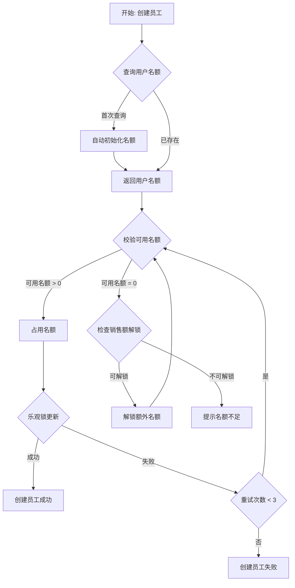
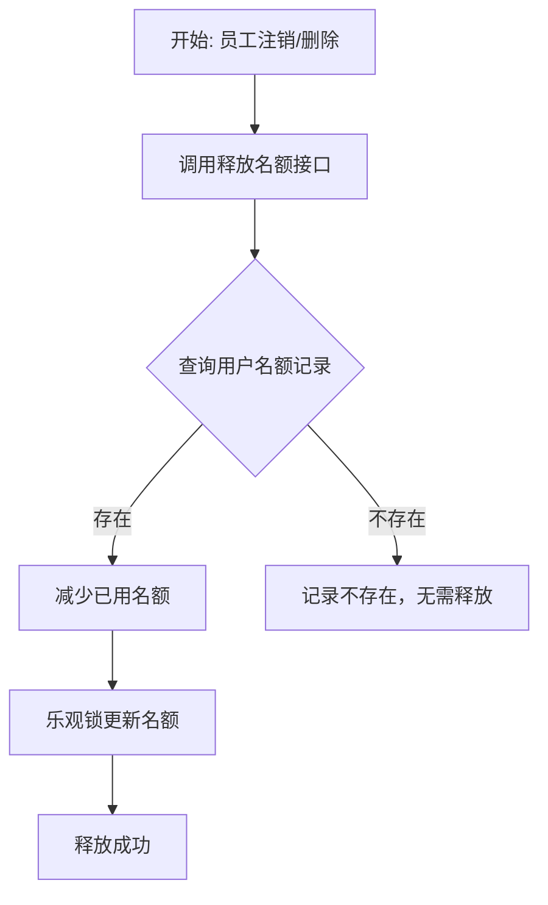
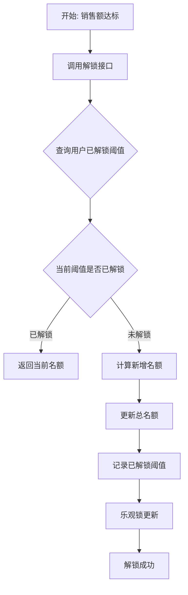
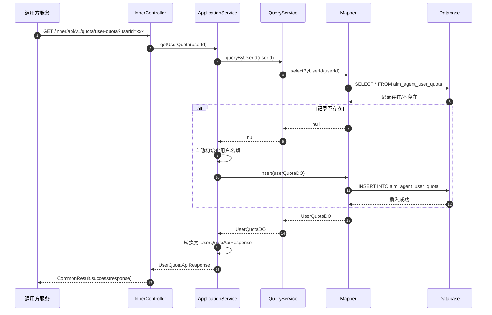
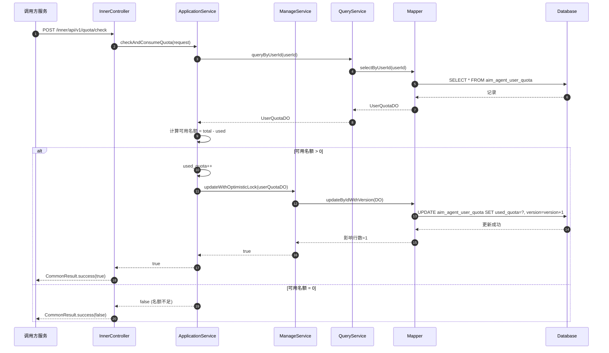
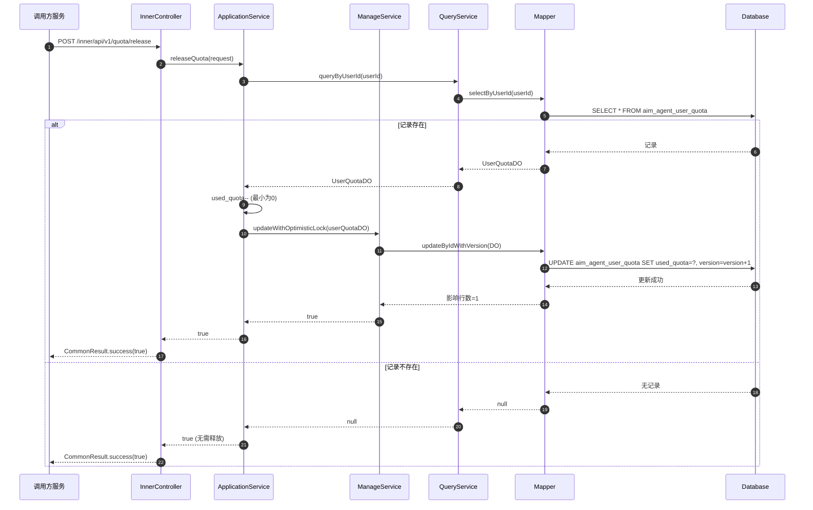
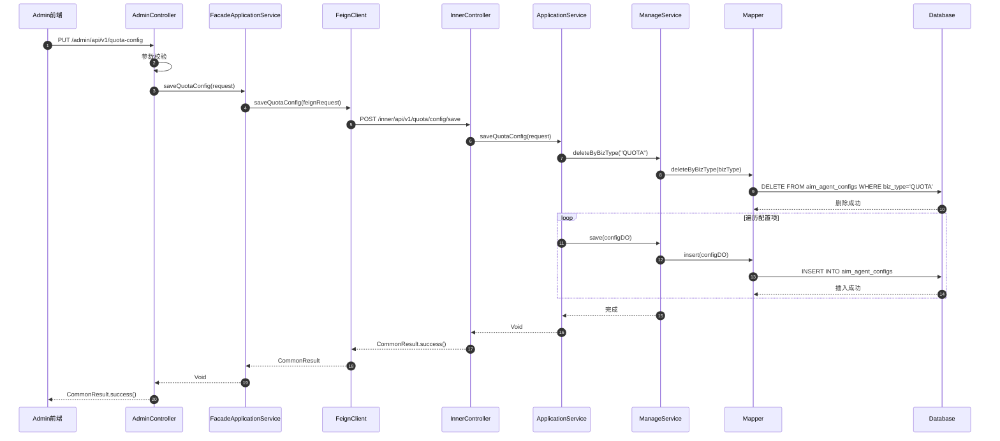
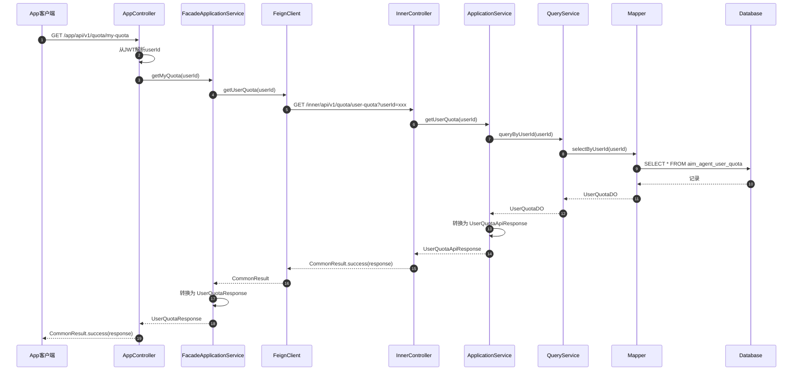

# 技术规格书：名额配置管理

## 1. 功能概述

| 属性 | 值 |
|------|-----|
| **功能编号** | F-003 |
| **功能名称** | 名额配置管理 |
| **所属领域** | 配置管理域 |
| **主模块** | mall-agent-employee-service |
| **优先级** | P0 |
| **功能描述** | 提供智能员工名额的查询、校验消耗、释放、销售额解锁能力，以及名额配置的全局管理能力 |

---

## 2. 内部 API 接口清单

| 接口名称 | 请求路径 | 方法 | 请求参数 | 响应类型 | 功能描述 |
|----------|----------|------|----------|----------|----------|
| getUserQuota | /inner/api/v1/quota/user-quota | GET | userId @RequestParam | CommonResult&lt;UserQuotaApiResponse&gt; | 查询用户名额信息（总/已用/可用名额） |
| checkQuota | /inner/api/v1/quota/check | POST | QuotaCheckApiRequest | CommonResult&lt;Boolean&gt; | 校验并消耗名额（创建员工前调用） |
| releaseQuota | /inner/api/v1/quota/release | POST | QuotaReleaseApiRequest | CommonResult&lt;Boolean&gt; | 释放名额（员工注销/删除时调用） |
| unlockQuota | /inner/api/v1/quota/unlock | POST | QuotaUnlockApiRequest | CommonResult&lt;UserQuotaApiResponse&gt; | 销售额解锁名额 |
| getQuotaConfig | /inner/api/v1/quota/config | GET | 无参数 | CommonResult&lt;QuotaConfigApiResponse&gt; | 查询全量名额配置 |
| saveQuotaConfig | /inner/api/v1/quota/config/save | POST | QuotaConfigSaveApiRequest | CommonResult&lt;Void&gt; | 全量覆盖保存名额配置 |

---

## 3. 门面 API 接口清单

### 3.1 Admin 门面接口

| 接口名称 | 请求路径 | 方法 | 请求参数 | 响应类型 | 功能描述 |
|----------|----------|------|----------|----------|----------|
| getQuotaConfig | /admin/api/v1/quota-config | GET | 无参数 | CommonResult&lt;QuotaConfigResponse&gt; | 获取当前全局名额配置 |
| saveQuotaConfig | /admin/api/v1/quota-config | PUT | QuotaConfigSaveRequest | CommonResult&lt;Void&gt; | 整体覆盖保存名额配置 |

### 3.2 App 门面接口

| 接口名称 | 请求路径 | 方法 | 请求参数 | 响应类型 | 功能描述 |
|----------|----------|------|----------|----------|----------|
| getMyQuota | /app/api/v1/quota/my-quota | GET | 无参数（从JWT获取userId） | CommonResult&lt;UserQuotaResponse&gt; | 查询当前登录用户的名额信息 |

---

## 4. 数据模型

### 4.1 通用配置表 (aim_agent_configs)

| 字段名 | 类型 | 说明 |
|--------|------|------|
| id | BIGINT | 主键ID |
| biz_type | VARCHAR(32) | 业务类型（QUOTA） |
| config_key | VARCHAR(64) | 配置键 |
| config_value | TEXT | 配置值（JSON） |
| create_time | DATETIME | 创建时间 |
| update_time | DATETIME | 更新时间 |

**删除策略**: 物理删除

### 4.2 用户名额汇总表 (aim_agent_user_quota)

| 字段名 | 类型 | 说明 |
|--------|------|------|
| id | BIGINT | 主键ID |
| user_id | BIGINT | 用户ID |
| total_quota | INT | 总名额 |
| used_quota | INT | 已用名额 |
| unlocked_thresholds | TEXT | 已解锁销售额阈值列表（JSON数组） |
| version | INT | 乐观锁版本号 |
| create_time | DATETIME | 创建时间 |
| update_time | DATETIME | 更新时间 |
| is_deleted | TINYINT | 软删除标记 |

**删除策略**: 软删除

---

## 5. 业务流程图

### 5.1 名额校验与消耗流程



### 5.2 名额释放流程



### 5.3 销售额解锁名额流程



---

## 6. 时序图

### 6.1 查询用户名额时序图



### 6.2 校验并消耗名额时序图



### 6.3 释放名额时序图



### 6.4 Admin 保存名额配置时序图



### 6.5 App 查询我的名额时序图



---

## 7. 业务规则

### 7.1 乐观锁机制

| 属性 | 值 |
|------|-----|
| **作用表** | aim_agent_user_quota |
| **版本字段** | version |
| **最大重试次数** | 3 |

### 7.2 名额来源

| 来源类型 | 说明 |
|----------|------|
| level_init | 系统根据用户等级分配初始名额 |
| sales_unlock | 销售额达到阈值时解锁额外名额 |

### 7.3 自动初始化规则

| 属性 | 值 |
|------|-----|
| **触发条件** | 新用户首次查询名额 |
| **初始化逻辑** | 根据用户等级从配置中读取初始名额 |

---

## 8. DTO 定义

### 8.1 内部 API DTO

#### QuotaCheckApiRequest

| 字段名 | 类型 | 必填 | 说明 |
|--------|------|------|------|
| userId | Long | 是 | 用户ID |
| scene | String | 否 | 场景标识 |

#### QuotaReleaseApiRequest

| 字段名 | 类型 | 必填 | 说明 |
|--------|------|------|------|
| userId | Long | 是 | 用户ID |
| employeeId | Long | 是 | 员工ID |

#### QuotaUnlockApiRequest

| 字段名 | 类型 | 必填 | 说明 |
|--------|------|------|------|
| userId | Long | 是 | 用户ID |
| salesAmount | BigDecimal | 是 | 当前销售额 |

#### UserQuotaApiResponse

| 字段名 | 类型 | 说明 |
|--------|------|------|
| userId | Long | 用户ID |
| totalQuota | Integer | 总名额 |
| usedQuota | Integer | 已用名额 |
| availableQuota | Integer | 可用名额 |
| unlockedThresholds | List&lt;BigDecimal&gt; | 已解锁销售额阈值列表 |

#### QuotaConfigApiResponse

| 字段名 | 类型 | 说明 |
|--------|------|------|
| levelConfigs | List&lt;LevelQuotaConfig&gt; | 等级名额配置列表 |
| unlockConfigs | List&lt;SalesUnlockConfig&gt; | 销售额解锁配置列表 |

#### QuotaConfigSaveApiRequest

| 字段名 | 类型 | 必填 | 说明 |
|--------|------|------|------|
| levelConfigs | List&lt;LevelQuotaConfig&gt; | 是 | 等级名额配置列表 |
| unlockConfigs | List&lt;SalesUnlockConfig&gt; | 是 | 销售额解锁配置列表 |

### 8.2 门面 API DTO

#### QuotaConfigResponse

| 字段名 | 类型 | 说明 |
|--------|------|------|
| levelConfigs | List&lt;LevelQuotaConfigVO&gt; | 等级名额配置列表 |
| unlockConfigs | List&lt;SalesUnlockConfigVO&gt; | 销售额解锁配置列表 |

#### QuotaConfigSaveRequest

| 字段名 | 类型 | 必填 | 说明 |
|--------|------|------|------|
| levelConfigs | List&lt;LevelQuotaConfigVO&gt; | 是 | 等级名额配置列表 |
| unlockConfigs | List&lt;SalesUnlockConfigVO&gt; | 是 | 销售额解锁配置列表 |

#### UserQuotaResponse

| 字段名 | 类型 | 说明 |
|--------|------|------|
| totalQuota | Integer | 总名额 |
| usedQuota | Integer | 已用名额 |
| availableQuota | Integer | 可用名额 |
| nextUnlockThreshold | BigDecimal | 下一解锁阈值 |
| nextUnlockQuota | Integer | 下一解锁名额数 |

---

## 9. 实现分层

| 层级 | 服务 | 职责 |
|------|------|------|
| 门面层 | mall-admin | Admin 后台管理接口 |
| 门面层 | mall-toc-service | App 客户端接口 |
| Feign层 | mall-inner-api | 内部服务调用接口定义 |
| 应用服务层 | mall-agent-employee-service | 名额业务核心逻辑 |

---

## 10. 规范合规性检查清单

### 10.1 门面 Controller 检查项

| 检查项 | 要求 | 状态 |
|--------|------|------|
| @Valid 校验 | 请求DTO必须使用@Valid进行参数校验 | ⬜ |
| Header 解析 | 用户ID等从Header/JWT解析，不从前端传 | ⬜ |
| ApplicationService 调用 | 必须调用ApplicationService，禁止直接调用Query/ManageService | ⬜ |
| Response DTO | 返回独立的Response DTO，禁止直接返回DO或内部DTO | ⬜ |
| 路径规范 | 遵循 /admin/api/v1/xxx 或 /app/api/v1/xxx 格式 | ⬜ |

### 10.2 内部 Controller 检查项

| 检查项 | 要求 | 状态 |
|--------|------|------|
| 手动校验 | 不使用@Valid，手动进行参数校验 | ⬜ |
| @RequestParam | GET请求参数使用@RequestParam | ⬜ |
| Query/ManageService 调用 | 可直接调用QueryService/ManageService | ⬜ |
| CommonResult | 返回CommonResult包装结果 | ⬜ |
| 路径规范 | 遵循 /inner/api/v1/xxx 格式 | ⬜ |

### 10.3 ApplicationService 检查项

| 检查项 | 要求 | 状态 |
|--------|------|------|
| String 去空格 | 对String类型参数进行trim处理 | ⬜ |
| DTO 转换 | 使用MapStruct或手动转换DO/DTO | ⬜ |
| 分层合规 | 禁止直接调用Mapper，通过Query/ManageService访问数据 | ⬜ |
| 事务控制 | 写操作使用@Transactional | ⬜ |

### 10.4 QueryService 检查项

| 检查项 | 要求 | 状态 |
|--------|------|------|
| 只读操作 | 仅包含查询操作，禁止增删改 | ⬜ |
| 原生 SQL | 复杂查询可使用原生SQL | ⬜ |
| 分页支持 | 列表查询必须支持分页 | ⬜ |

### 10.5 ManageService 检查项

| 检查项 | 要求 | 状态 |
|--------|------|------|
| MP 增删改 | 使用MyBatis-Plus进行增删改操作 | ⬜ |
| 业务校验 | 包含必要的业务校验逻辑 | ⬜ |
| 乐观锁 | 并发更新使用乐观锁机制 | ⬜ |

### 10.6 DO 检查项

| 检查项 | 要求 | 状态 |
|--------|------|------|
| 继承 BaseDO | 必须继承BaseDO | ⬜ |
| 字段对应 | 字段名与数据库列名对应 | ⬜ |
| 注解完整 | @TableName、@TableId、@TableField完整 | ⬜ |

### 10.7 Mapper 检查项

| 检查项 | 要求 | 状态 |
|--------|------|------|
| Base_Column_List | XML中定义Base_Column_List | ⬜ |
| 禁止 SELECT * | 必须使用Base_Column_List | ⬜ |
| 方法命名 | 遵循selectXXX、insertXXX、updateXXX、deleteXXX规范 | ⬜ |

### 10.8 Feign 检查项

| 检查项 | 要求 | 状态 |
|--------|------|------|
| @FeignClient | 使用@FeignClient定义客户端 | ⬜ |
| @RequestParam | GET请求参数使用@RequestParam | ⬜ |
| CommonResult | 返回类型使用CommonResult包装 | ⬜ |
| 路径一致 | 路径与内部Controller保持一致 | ⬜ |

---

## 11. 数据库脚本

### 11.1 建表语句

```sql
-- 通用配置表
CREATE TABLE IF NOT EXISTS `aim_agent_configs` (
    `id` BIGINT NOT NULL AUTO_INCREMENT COMMENT '主键ID',
    `biz_type` VARCHAR(32) NOT NULL COMMENT '业务类型（QUOTA）',
    `config_key` VARCHAR(64) NOT NULL COMMENT '配置键',
    `config_value` TEXT COMMENT '配置值（JSON）',
    `create_time` DATETIME NOT NULL DEFAULT CURRENT_TIMESTAMP COMMENT '创建时间',
    `update_time` DATETIME NOT NULL DEFAULT CURRENT_TIMESTAMP ON UPDATE CURRENT_TIMESTAMP COMMENT '更新时间',
    PRIMARY KEY (`id`),
    UNIQUE KEY `uk_biz_type_key` (`biz_type`, `config_key`),
    KEY `idx_biz_type` (`biz_type`)
) ENGINE=InnoDB DEFAULT CHARSET=utf8mb4 COMMENT='通用配置表';

-- 用户名额汇总表
CREATE TABLE IF NOT EXISTS `aim_agent_user_quota` (
    `id` BIGINT NOT NULL AUTO_INCREMENT COMMENT '主键ID',
    `user_id` BIGINT NOT NULL COMMENT '用户ID',
    `total_quota` INT NOT NULL DEFAULT 0 COMMENT '总名额',
    `used_quota` INT NOT NULL DEFAULT 0 COMMENT '已用名额',
    `unlocked_thresholds` TEXT COMMENT '已解锁销售额阈值列表（JSON数组）',
    `version` INT NOT NULL DEFAULT 0 COMMENT '乐观锁版本号',
    `create_time` DATETIME NOT NULL DEFAULT CURRENT_TIMESTAMP COMMENT '创建时间',
    `update_time` DATETIME NOT NULL DEFAULT CURRENT_TIMESTAMP ON UPDATE CURRENT_TIMESTAMP COMMENT '更新时间',
    `is_deleted` TINYINT NOT NULL DEFAULT 0 COMMENT '软删除标记',
    PRIMARY KEY (`id`),
    UNIQUE KEY `uk_user_id` (`user_id`),
    KEY `idx_user_id_deleted` (`user_id`, `is_deleted`)
) ENGINE=InnoDB DEFAULT CHARSET=utf8mb4 COMMENT='用户名额汇总表';
```

### 11.2 初始化数据

```sql
-- 初始化名额配置
INSERT INTO `aim_agent_configs` (`biz_type`, `config_key`, `config_value`) VALUES
('QUOTA', 'LEVEL_1_INIT', '{"quota": 3}'),
('QUOTA', 'LEVEL_2_INIT', '{"quota": 5}'),
('QUOTA', 'LEVEL_3_INIT', '{"quota": 10}'),
('QUOTA', 'LEVEL_4_INIT', '{"quota": 20}'),
('QUOTA', 'LEVEL_5_INIT', '{"quota": 50}'),
('QUOTA', 'UNLOCK_CONFIG', '[{"threshold": 10000, "quota": 2}, {"threshold": 50000, "quota": 5}, {"threshold": 100000, "quota": 10}]');
```

---

## 12. 版本历史

| 版本 | 日期 | 作者 | 变更说明 |
|------|------|------|----------|
| 1.0 | 2026-03-16 | AI-Code | 初始版本 |
