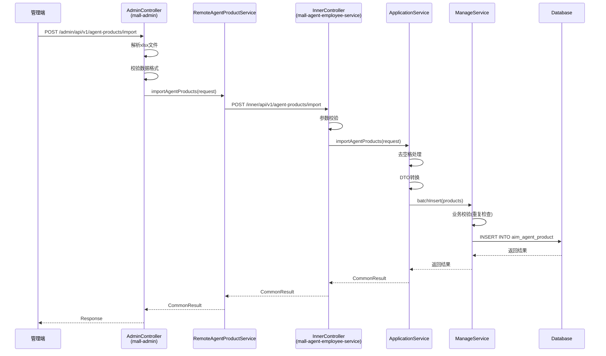
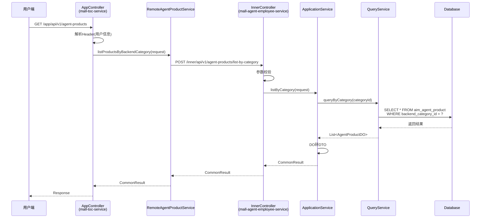
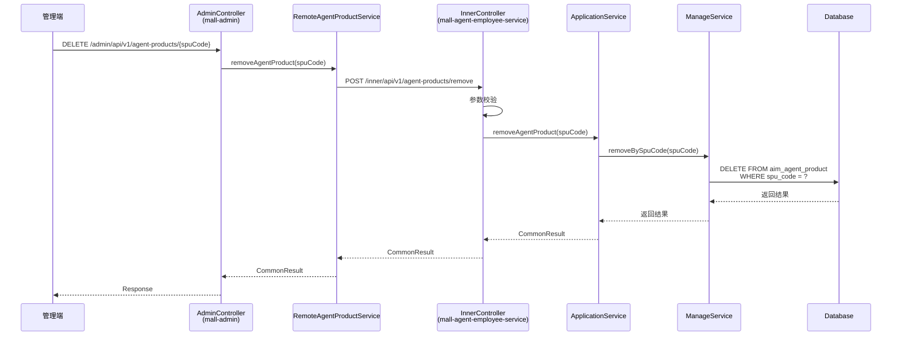
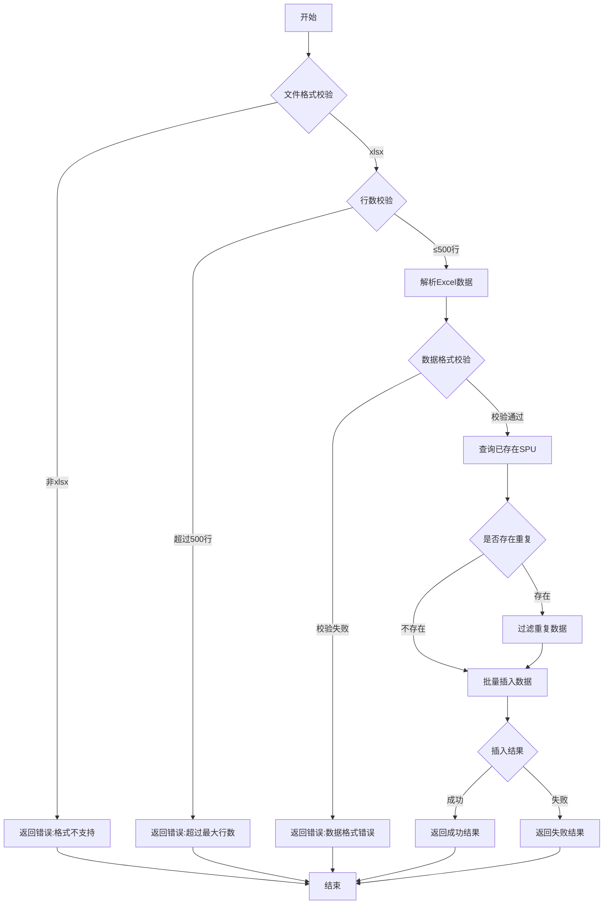
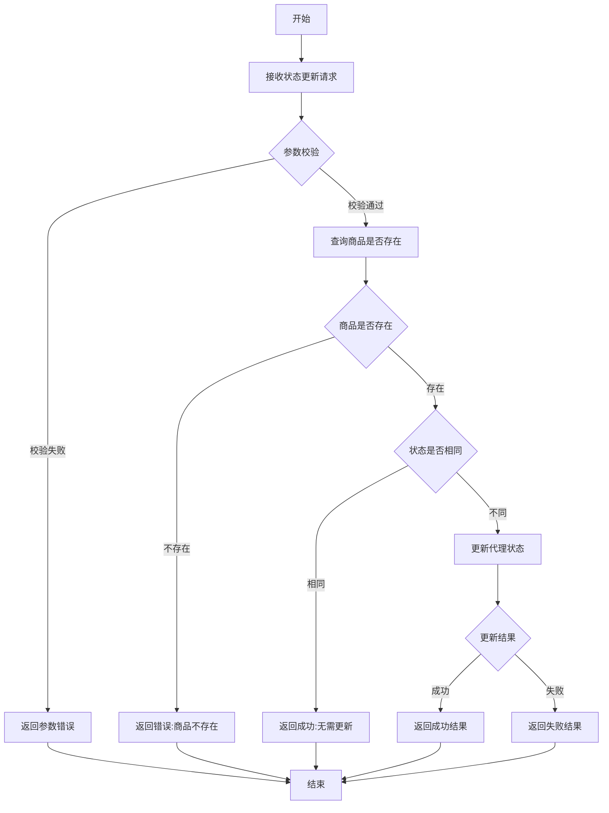
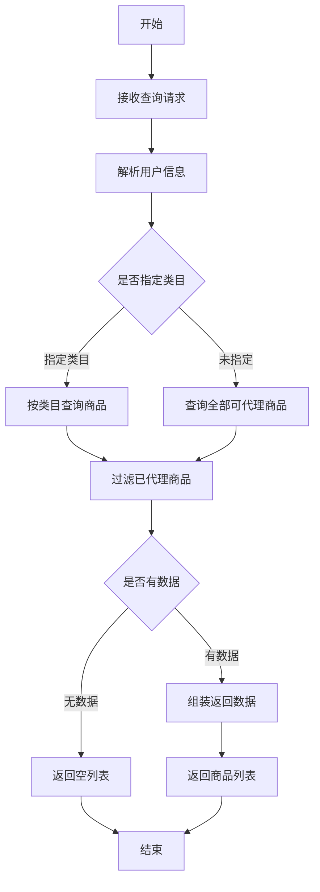

# Feature 技术规格: F-004 代理商品配置

## 1. 基本信息

| 属性 | 值 |
|------|-----|
| Feature ID | F-004 |
| Feature 名称 | 代理商品配置 |
| 所属域 | 配置管理域 |
| 所属模块 | mall-agent-employee-service |
| 优先级 | P0 |
| 描述 | 管理端代理商品池管理，支持xlsx批量导入，用户端按后台类目搜索可代理商品 |

---

## 2. 内部接口定义（Inner APIs）

| 接口名称 | 请求路径 | 请求方法 | 说明 |
|---------|---------|---------|------|
| pageAgentProducts | /inner/api/v1/agent-products/page | POST | 分页查询代理商品 |
| importAgentProducts | /inner/api/v1/agent-products/import | POST | 批量导入代理商品 |
| removeAgentProduct | /inner/api/v1/agent-products/remove | POST | 移除代理商品 |
| listProductsByBackendCategory | /inner/api/v1/agent-products/list-by-category | POST | 按后台类目查询商品 |
| checkSpuAgented | /inner/api/v1/agent-products/check-agented | GET | 检查SPU是否已代理 |
| updateAgentStatus | /inner/api/v1/agent-products/update-status | POST | 更新代理状态 |
| releaseAgentProduct | /inner/api/v1/agent-products/release | POST | 发布代理商品 |

---

## 3. 门面接口定义（Facade APIs）

### 3.1 管理端接口（Admin）

| 接口名称 | 请求路径 | 请求方法 | 说明 |
|---------|---------|---------|------|
| list | /admin/api/v1/agent-products | GET | 查询代理商品列表 |
| import | /admin/api/v1/agent-products/import | POST | 导入代理商品 |
| remove | /admin/api/v1/agent-products/{spuCode} | DELETE | 删除代理商品 |

### 3.2 用户端接口（App）

| 接口名称 | 请求路径 | 请求方法 | 说明 |
|---------|---------|---------|------|
| getCategories | /app/api/v1/agent-products/categories | GET | 获取代理商品类目 |
| list | /app/api/v1/agent-products | GET | 查询可代理商品列表 |

---

## 4. 数据库表设计

### 4.1 表基本信息

| 表名 | 说明 |
|------|------|
| aim_agent_product | 代理商品池表 |

### 4.2 字段定义

| 字段名 | 类型 | 是否必填 | 默认值 | 说明 |
|--------|------|---------|--------|------|
| id | BIGINT | 是 | 自增 | 主键ID |
| spu_code | VARCHAR(64) | 是 | - | SPU编码 |
| spu_name | VARCHAR(255) | 是 | - | SPU名称 |
| backend_category_id | BIGINT | 是 | - | 后台类目ID |
| backend_category_name | VARCHAR(128) | 是 | - | 后台类目名称 |
| price | DECIMAL(10,2) | 是 | - | 商品价格 |
| agent_status | TINYINT | 是 | 0 | 代理状态：0-未代理 1-已代理 |
| create_time | DATETIME | 是 | CURRENT_TIMESTAMP | 创建时间 |
| update_time | DATETIME | 是 | CURRENT_TIMESTAMP | 更新时间 |

### 4.3 索引设计

| 索引名 | 索引类型 | 字段 | 说明 |
|--------|---------|------|------|
| uk_spu_code | UNIQUE | spu_code | SPU编码唯一索引 |
| idx_backend_category_id | NORMAL | backend_category_id | 后台类目ID索引 |
| idx_agent_status | NORMAL | agent_status | 代理状态索引 |

---

## 5. 业务规则

### 5.1 批量导入规则

| 规则项 | 值 | 说明 |
|--------|-----|------|
| 导入格式 | xlsx | 仅支持Excel格式 |
| 最大行数 | 500 | 单次导入最大500行 |

### 5.2 代理状态定义

| 状态值 | 含义 | 说明 |
|--------|------|------|
| 0 | 未代理 | 商品未加入代理池 |
| 1 | 已代理 | 商品已加入代理池 |

---

## 6. 接口调用时序图

### 6.1 管理端导入代理商品时序图



### 6.2 用户端查询可代理商品时序图



### 6.3 管理端删除代理商品时序图



---

## 7. 业务流程图

### 7.1 代理商品导入流程



### 7.2 代理状态更新流程



### 7.3 用户端查询可代理商品流程



---

## 8. 规范合规性检查清单

### 8.1 门面服务层（Facade Service）

| 检查项 | 要求 | 状态 |
|--------|------|------|
| Controller 注解 | 使用 @RestController | ⬜ 待检查 |
| 请求参数校验 | 使用 @Valid 注解 | ⬜ 待检查 |
| Header 解析 | 正确解析用户信息 | ⬜ 待检查 |
| ApplicationService 调用 | 通过 Feign 调用内部服务 | ⬜ 待检查 |
| Response DTO | 统一使用 Response DTO 返回 | ⬜ 待检查 |
| 异常处理 | 统一异常处理机制 | ⬜ 待检查 |

### 8.2 应用服务层（Inner Service）

| 检查项 | 要求 | 状态 |
|--------|------|------|
| InnerController 注解 | 使用 @RestController | ⬜ 待检查 |
| 参数校验 | 手动校验 @RequestParam | ⬜ 待检查 |
| Service 分层 | QueryService 只读，ManageService 可写 | ⬜ 待检查 |
| ApplicationService | 字符串去空格、DTO 转换 | ⬜ 待检查 |
| 返回值 | 统一使用 CommonResult | ⬜ 待检查 |

### 8.3 数据访问层（Mapper）

| 检查项 | 要求 | 状态 |
|--------|------|------|
| Base_Column_List | 定义基础字段列表 | ⬜ 待检查 |
| SELECT 语句 | 禁止 SELECT * | ⬜ 待检查 |
| 字段映射 | 正确映射数据库字段 | ⬜ 待检查 |
| 索引使用 | 查询使用正确索引 | ⬜ 待检查 |

### 8.4 Feign 接口层

| 检查项 | 要求 | 状态 |
|--------|------|------|
| @FeignClient | 正确配置服务名称 | ⬜ 待检查 |
| @RequestParam | 参数使用 @RequestParam 注解 | ⬜ 待检查 |
| 返回值类型 | 统一使用 CommonResult | ⬜ 待检查 |
| 接口路径 | 与 InnerController 路径一致 | ⬜ 待检查 |

### 8.5 实体类（DO）

| 检查项 | 要求 | 状态 |
|--------|------|------|
| 继承 BaseDO | 正确继承基础实体类 | ⬜ 待检查 |
| 字段类型 | 与数据库字段类型对应 | ⬜ 待检查 |
| 注解使用 | 正确使用 @TableName 等注解 | ⬜ 待检查 |

### 8.6 数据库脚本

| 检查项 | 要求 | 状态 |
|--------|------|------|
| 表结构定义 | 符合表设计规范 | ⬜ 待检查 |
| 索引定义 | 正确定义索引 | ⬜ 待检查 |
| 测试数据 | 提供测试数据脚本 | ⬜ 待检查 |

---

## 9. 实现计划

### 9.1 生成顺序

```
1. Feign 接口（mall-inner-api）
   └── RemoteAgentProductService
   └── ApiRequest / ApiResponse DTO

2. 应用服务层（mall-agent-employee-service）
   └── AgentProductDO
   └── AgentProductMapper
   └── AgentProductQueryService / AgentProductManageService
   └── AgentProductApplicationService
   └── AgentProductInnerController

3. 门面服务层（mall-admin）
   └── AgentProductRequest / AgentProductResponse
   └── AgentProductApplicationService
   └── AgentProductAdminController

4. 门面服务层（mall-toc-service）
   └── AgentProductAppController
   └── AgentProductAppService

5. 数据库脚本
   └── schema.sql
   └── test-data.sql

6. HTTP 测试文件
   └── agent-product-api.http
```

### 9.2 预估工作量

| 任务 | 预估时间 |
|------|---------|
| Feign 接口开发 | 0.5h |
| 应用服务层开发 | 2h |
| 门面服务层开发 | 1.5h |
| 数据库脚本编写 | 0.5h |
| 单元测试编写 | 1h |
| 联调测试 | 1h |
| **总计** | **6.5h** |

---

## 10. 附录

### 10.1 相关文档

- 门面服务规范：`.qoder/rules/code-generation/01-facade-service.md`
- 应用服务规范：`.qoder/rules/code-generation/02-inner-service.md`
- Feign 接口规范：`.qoder/rules/code-generation/03-feign-interface.md`

### 10.2 版本历史

| 版本 | 日期 | 修改人 | 修改内容 |
|------|------|--------|---------|
| v1.0 | 2026-03-16 | AI Agent | 初始版本 |
