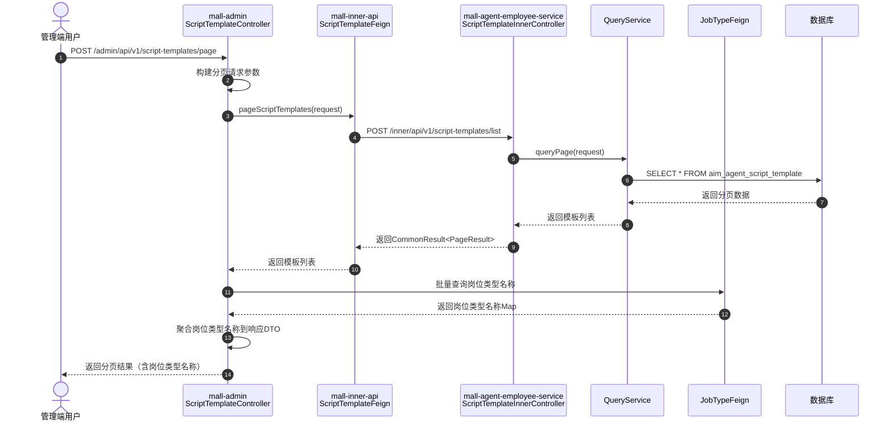
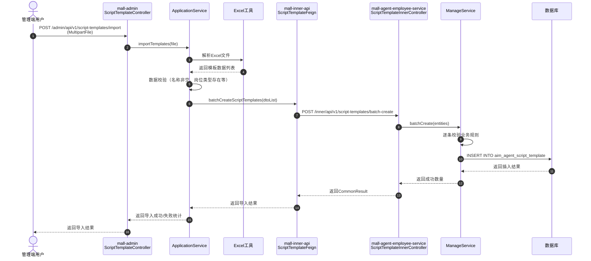
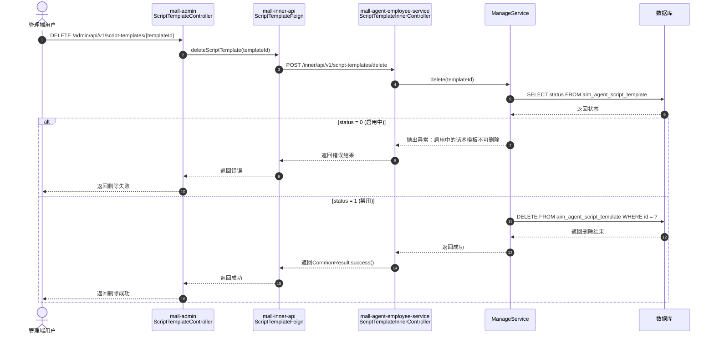
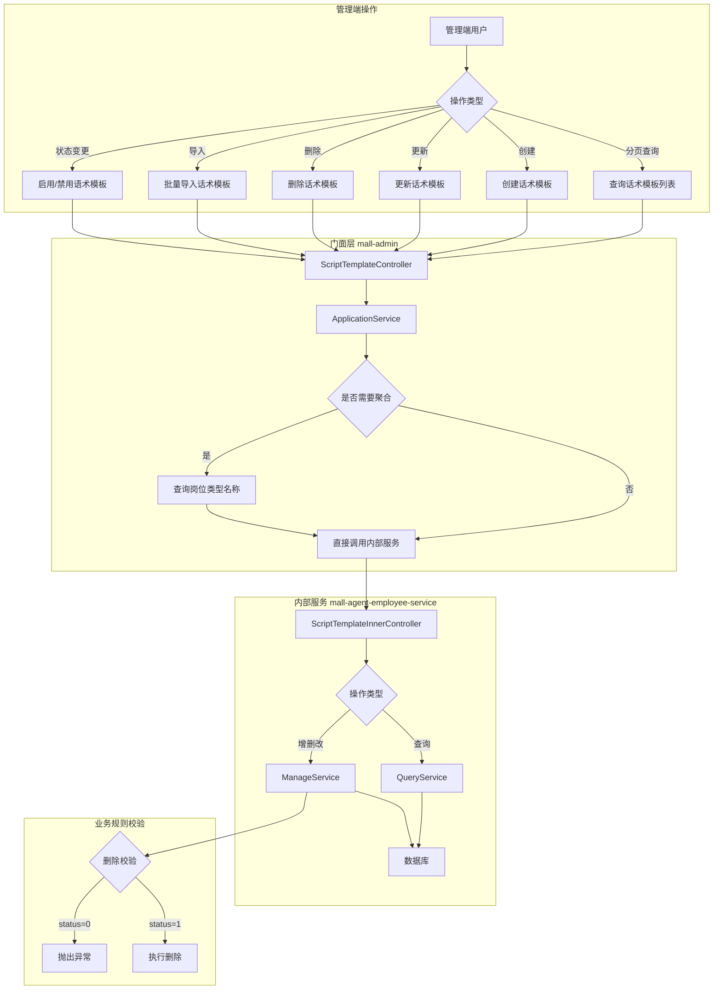
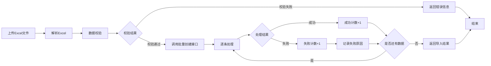
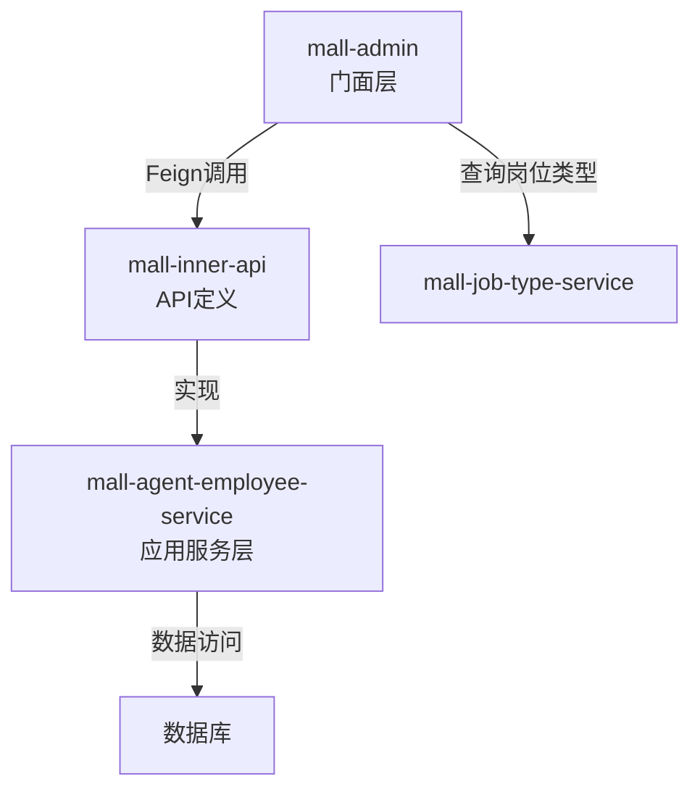

# 话术模板管理 - 技术规格书

## 1. 功能概述

| 属性 | 值 |
|------|-----|
| 功能编号 | F-005 |
| 功能名称 | 话术模板管理 |
| 所属域 | 配置管理域 |
| 所属模块 | mall-agent-employee-service |
| 优先级 | P1 |
| 功能描述 | 管理端话术模板CRUD+xlsx批量导入，门面层聚合岗位类型名称 |

---

## 2. 接口清单

### 2.1 内部服务接口 (mall-agent-employee-service)

| 接口名称 | 请求路径 | 请求方法 | 说明 |
|----------|----------|----------|------|
| pageScriptTemplates | /inner/api/v1/script-templates/list | POST | 分页查询话术模板 |
| createScriptTemplate | /inner/api/v1/script-templates/create | POST | 创建话术模板 |
| updateScriptTemplate | /inner/api/v1/script-templates/update | POST | 更新话术模板 |
| updateScriptTemplateStatus | /inner/api/v1/script-templates/status | POST | 更新话术模板状态 |
| deleteScriptTemplate | /inner/api/v1/script-templates/delete | POST | 删除话术模板 |
| batchCreateScriptTemplates | /inner/api/v1/script-templates/batch-create | POST | 批量创建话术模板 |

### 2.2 门面服务接口 (mall-admin)

| 接口名称 | 请求路径 | 请求方法 | 说明 |
|----------|----------|----------|------|
| getImportTemplate | /admin/api/v1/script-templates/import-template | GET | 获取导入模板 |
| getJobTypes | /admin/api/v1/script-templates/job-types | GET | 获取岗位类型列表 |
| page | /admin/api/v1/script-templates/page | POST | 分页查询话术模板（聚合岗位类型名称） |
| create | /admin/api/v1/script-templates | POST | 创建话术模板 |
| update | /admin/api/v1/script-templates/{templateId} | PUT | 更新话术模板 |
| status | /admin/api/v1/script-templates/{templateId}/status | PUT | 更新话术模板状态 |
| delete | /admin/api/v1/script-templates/{templateId} | DELETE | 删除话术模板 |
| import | /admin/api/v1/script-templates/import | POST | 批量导入话术模板 |

---

## 3. 数据模型

### 3.1 话术模板表 (aim_agent_script_template)

| 字段名 | 类型 | 说明 |
|--------|------|------|
| id | BIGINT | 主键ID |
| name | VARCHAR(128) | 话术模板名称 |
| trigger_condition | VARCHAR(255) | 触发条件 |
| content | VARCHAR(500) | 话术内容 |
| job_type_id | BIGINT | 岗位类型ID |
| status | TINYINT | 状态：0-启用，1-禁用 |
| create_time | DATETIME | 创建时间 |
| update_time | DATETIME | 更新时间 |

---

## 4. 业务规则

| 规则名称 | 规则描述 |
|----------|----------|
| 删除约束 | 启用中的话术模板不可删除（status = 0 时禁止删除） |
| 门面聚合 | 门面层需两跳聚合：话术模板 → 岗位类型ID → 岗位类型名称 |

---

## 5. 时序图

### 5.1 分页查询话术模板（带聚合）

### 5.2 批量导入话术模板

### 5.3 删除话术模板

---

## 6. 业务流程图

### 6.1 话术模板管理整体流程

### 6.2 批量导入流程

---

## 7. 规范合规性检查清单

### 7.1 门面层 (mall-admin) 检查项

| 检查项 | 要求 | 状态 |
|--------|------|------|
| Controller 路径规范 | 使用 `/admin/api/v1/` 前缀 | ⬜ |
| 请求参数校验 | 使用 `@Valid` 进行参数校验 | ⬜ |
| Header 解析 | 正确解析 `userId`、`userName`、`tenantId` | ⬜ |
| 响应封装 | 返回统一响应格式 | ⬜ |
| 聚合逻辑 | 门面层负责岗位类型名称聚合 | ⬜ |
| RESTful 规范 | GET/POST/PUT/DELETE 使用正确 | ⬜ |

### 7.2 内部服务层 (mall-agent-employee-service) 检查项

| 检查项 | 要求 | 状态 |
|--------|------|------|
| Controller 路径规范 | 使用 `/inner/api/v1/` 前缀 | ⬜ |
| 参数接收 | 使用 `@RequestParam` 或 `@RequestBody` | ⬜ |
| 响应封装 | 返回 `CommonResult` 统一格式 | ⬜ |
| 业务校验 | ManageService 中实现业务规则校验 | ⬜ |
| 删除约束 | 启用状态禁止删除 | ⬜ |

### 7.3 数据访问层检查项

| 检查项 | 要求 | 状态 |
|--------|------|------|
| DO 继承 | 继承 `BaseDO` | ⬜ |
| 字段映射 | 与数据库表字段一一对应 | ⬜ |
| Mapper | 定义 `Base_Column_List` | ⬜ |
| SQL 规范 | 禁止使用 `SELECT *` | ⬜ |
| QueryService | 只读操作，可使用原生 SQL | ⬜ |
| ManageService | 使用 MyBatis-Plus 增删改 | ⬜ |

### 7.4 Feign 接口检查项

| 检查项 | 要求 | 状态 |
|--------|------|------|
| 注解 | 使用 `@FeignClient` | ⬜ |
| 参数传递 | 使用 `@RequestParam` / `@RequestBody` | ⬜ |
| 响应类型 | 返回 `CommonResult` | ⬜ |
| 路径匹配 | 与内部 Controller 路径一致 | ⬜ |

### 7.5 数据库脚本检查项

| 检查项 | 要求 | 状态 |
|--------|------|------|
| 表名 | 使用 `aim_agent_script_template` | ⬜ |
| 字段类型 | 与规格定义一致 | ⬜ |
| 注释 | 表和字段均需添加注释 | ⬜ |
| 索引 | 根据查询需求添加索引 | ⬜ |

---

## 8. 实现顺序

| 顺序 | 层级 | 说明 |
|------|------|------|
| 1 | Feign 接口 | mall-inner-api 定义远程调用接口 |
| 2 | 应用服务层 | mall-agent-employee-service 实现 CRUD |
| 3 | 门面服务层 | mall-admin 实现聚合和导入导出 |
| 4 | 数据库脚本 | schema.sql + test-data.sql |
| 5 | HTTP 测试 | .http 接口测试文件 |

---

## 9. 依赖关系

---

*文档生成时间：2026-03-16*
*功能编号：F-005*
