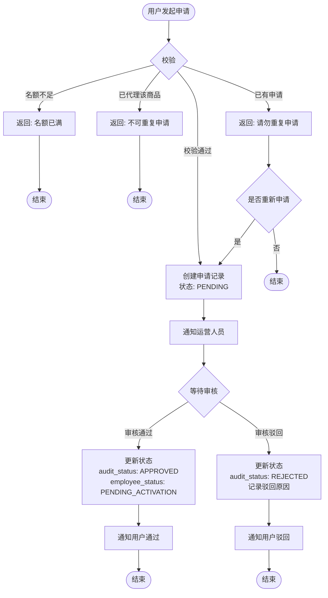
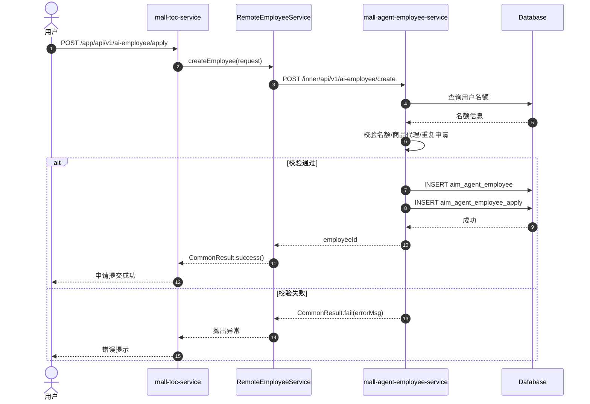
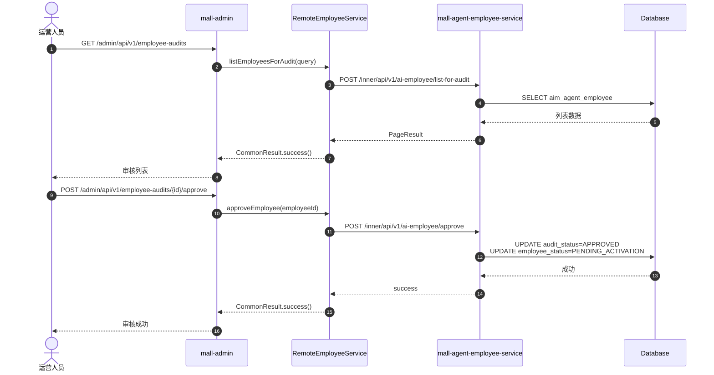
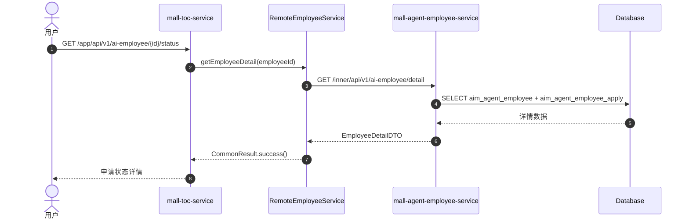

# 技术规格书 - F-006 智能员工申请与审核

## 1. 基本信息

| 属性 | 值 |
|------|-----|
| Feature ID | F-006 |
| 功能名称 | 智能员工申请与审核 |
| 所属领域 | 员工生命周期域 |
| 主模块 | mall-agent-employee-service |
| 优先级 | P0 |
| 功能描述 | 用户提交智能员工申请，运营人员审核（通过/驳回+原因） |

---

## 2. 接口清单

### 2.1 内部服务 API (mall-agent-employee-service)

| 接口名称 | 请求路径 | 方法 | 说明 |
|----------|----------|------|------|
| createEmployee | /inner/api/v1/ai-employee/create | POST | 创建智能员工 |
| reApplyEmployee | /inner/api/v1/ai-employee/re-apply | POST | 重新申请 |
| getEmployeeDetail | /inner/api/v1/ai-employee/detail | GET | 获取员工详情 |
| listEmployeesByUser | /inner/api/v1/ai-employee/list-by-user | POST | 按用户查询列表 |
| listEmployeesForAudit | /inner/api/v1/ai-employee/list-for-audit | POST | 查询待审核列表 |
| getAuditStatusCount | /inner/api/v1/ai-employee/audit-status-count | GET | 获取审核状态统计 |
| approveEmployee | /inner/api/v1/ai-employee/approve | POST | 审核通过 |
| rejectEmployee | /inner/api/v1/ai-employee/reject | POST | 审核驳回 |

### 2.2 C端应用 API (mall-toc-service)

| 接口名称 | 请求路径 | 方法 | 说明 |
|----------|----------|------|------|
| getIntro | /app/api/v1/ai-employee/intro | GET | 获取申请介绍 |
| apply | /app/api/v1/ai-employee/apply | POST | 提交申请 |
| getStatus | /app/api/v1/ai-employee/{employeeId}/status | GET | 查询申请状态 |
| listMyEmployees | /app/api/v1/ai-employee/list | GET | 查询我的员工列表 |

### 2.3 运营后台 API (mall-admin)

| 接口名称 | 请求路径 | 方法 | 说明 |
|----------|----------|------|------|
| listAudits | /admin/api/v1/employee-audits | GET | 审核列表查询 |
| getStatusCount | /admin/api/v1/employee-audits/status-count | GET | 获取状态统计 |
| getAuditDetail | /admin/api/v1/employee-audits/{employeeId}/detail | GET | 审核详情 |
| approve | /admin/api/v1/employee-audits/{employeeId}/approve | POST | 审核通过 |
| reject | /admin/api/v1/employee-audits/{employeeId}/reject | POST | 审核驳回 |

---

## 3. 数据模型

### 3.1 智能员工主表 (aim_agent_employee)

> **删除策略**: 时间戳软删除（`deleted_at`，NULL=未注销）

| 字段名 | 类型 | 说明 |
|--------|------|------|
| id | BIGINT | 主键ID |
| user_id | BIGINT | 用户ID |
| employee_no | VARCHAR(32) | 员工编号，格式：AIM{yyyyMM}{序列号} |
| name | VARCHAR(64) | 员工名称（系统自动生成） |
| job_type_id | BIGINT | 岗位类型ID |
| spu_code | VARCHAR(64) | SPU编码（商品销售岗必填，客服岗为null） |
| style_config_id | BIGINT | 人设风格配置ID |
| audit_status | TINYINT | 审核状态：0-待审核 1-已驳回 2-已通过 |
| employee_status | TINYINT | 员工状态（仅audit_status=2时有效） |
| commission_rate | DECIMAL(5,2) | 佣金比例（0.00~100.00） |
| reject_reason | VARCHAR(255) | 驳回原因 |
| prompt | TEXT | Prompt内容（F-009生成） |
| invite_code | VARCHAR(16) | 邀请码（Base62编码，懒生成） |
| creator_id | BIGINT | 创建人ID |
| updater_id | BIGINT | 更新人ID |
| deleted_at | DATETIME | 注销时间（NULL=未注销） |

### 3.2 申请扩展表 (aim_agent_employee_apply)

| 字段名 | 类型 | 说明 |
|--------|------|------|
| id | BIGINT | 主键ID |
| employee_id | BIGINT | 员工ID |
| social_links | TEXT | 社交链接 |
| screenshots | TEXT | 截图凭证 |

---

## 4. 业务流程图



---

## 5. 时序图

### 5.1 用户申请流程



### 5.2 运营审核流程



### 5.3 用户查询申请状态



---

## 6. 业务规则

### 6.1 校验顺序

| 顺序 | 校验项 | 失败处理 |
|------|--------|----------|
| 1 | 名额校验 | 返回"名额已满" |
| 2 | 商品代理校验 | 返回"不可重复申请同一商品" |
| 3 | 重复申请校验 | 返回"已有申请记录，请勿重复申请" |

### 6.2 状态机

#### 审核状态 (audit_status)

| 状态值 | 说明 |
|--------|------|
| PENDING | 待审核 |
| APPROVED | 审核通过 |
| REJECTED | 审核驳回 |

#### 员工状态 (employee_status)

| 状态值 | 说明 |
|--------|------|
| PENDING_ACTIVATION | 待激活 |
| PENDING_ONLINE | 待上线 |
| OPERATING | 运营中 |
| FORCE_OFFLINE | 强制下线 |
| BANNED | 已封禁 |

---

## 7. 实现分层

### 7.1 代码生成顺序

| 顺序 | 服务 | 生成内容 |
|------|------|----------|
| 1 | mall-inner-api | Feign接口、DTO定义 |
| 2 | mall-agent-employee-service | DO、Mapper、Service、Controller |
| 3 | mall-toc-service | AppController、AppService |
| 4 | mall-admin | AdminController、AdminService |
| 5 | - | 数据库脚本、HTTP测试文件 |

### 7.2 服务依赖关系

```
mall-toc-service ──► mall-inner-api ◄── mall-agent-employee-service
mall-admin ────────► mall-inner-api ◄── mall-agent-employee-service
```

---

## 8. 规范合规性检查清单

### 8.1 门面服务 (mall-toc-service / mall-admin)

| 检查项 | 规范要求 | 状态 |
|--------|----------|------|
| 请求DTO | 继承 BaseRequest，字段加 @NotBlank/@NotNull | ⬜ 待检查 |
| 响应DTO | 继承 BaseResponse，无继承关系 | ⬜ 待检查 |
| Controller | 使用 @Valid，解析 Header，调用 ApplicationService | ⬜ 待检查 |
| ApplicationService | 调用 Feign，处理异常，DTO转换 | ⬜ 待检查 |
| 异常处理 | 统一异常拦截，返回标准错误格式 | ⬜ 待检查 |

### 8.2 应用服务 (mall-agent-employee-service)

| 检查项 | 规范要求 | 状态 |
|--------|----------|------|
| DO实体 | 继承 BaseDO，字段与表一致 | ⬜ 待检查 |
| Mapper | 定义 Base_Column_List，禁止 SELECT * | ⬜ 待检查 |
| QueryService | 只读操作，允许原生SQL | ⬜ 待检查 |
| ManageService | MP增删改，业务校验 | ⬜ 待检查 |
| InnerController | 手动校验，@RequestParam，返回 CommonResult | ⬜ 待检查 |
| 字符串处理 | 入参加 .trim() | ⬜ 待检查 |

### 8.3 Feign 接口 (mall-inner-api)

| 检查项 | 规范要求 | 状态 |
|--------|----------|------|
| 接口定义 | @FeignClient 指定服务名 | ⬜ 待检查 |
| 参数传递 | GET请求用 @RequestParam | ⬜ 待检查 |
| 返回值 | 统一返回 CommonResult | ⬜ 待检查 |
| DTO | 实现 Serializable | ⬜ 待检查 |

### 8.4 数据库脚本

| 检查项 | 规范要求 | 状态 |
|--------|----------|------|
| 表名 | 小写，下划线分隔 | ⬜ 待检查 |
| 字段 | 小写，下划线分隔 | ⬜ 待检查 |
| 索引 | 合理创建索引 | ⬜ 待检查 |
| 注释 | 表和字段都要有注释 | ⬜ 待检查 |

---

## 9. 附录

### 9.1 错误码定义

| 错误码 | 说明 |
|--------|------|
| EMPLOYEE_QUOTA_EXCEEDED | 员工名额已满 |
| EMPLOYEE_DUPLICATE_SPU | 已代理该商品 |
| EMPLOYEE_ALREADY_APPLIED | 已有申请记录 |
| EMPLOYEE_NOT_FOUND | 员工记录不存在 |
| EMPLOYEE_INVALID_STATUS | 状态不允许此操作 |

### 9.2 相关文档

- 流程定义: `orchestrator/WORKFLOWS/feature-implementation/workflow.yml`
- 门面服务规范: `.qoder/rules/code-generation/01-facade-service.md`
- 应用服务规范: `.qoder/rules/code-generation/02-inner-service.md`
- Feign接口规范: `.qoder/rules/code-generation/03-feign-interface.md`
