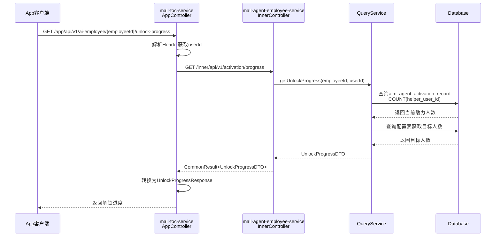
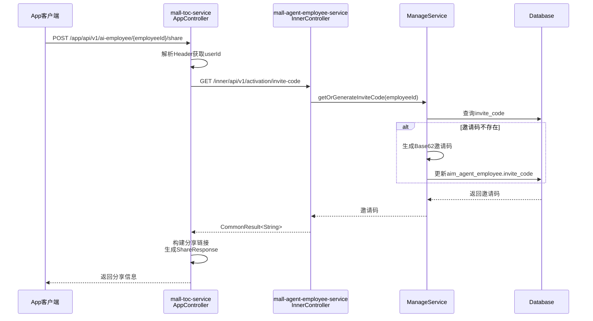
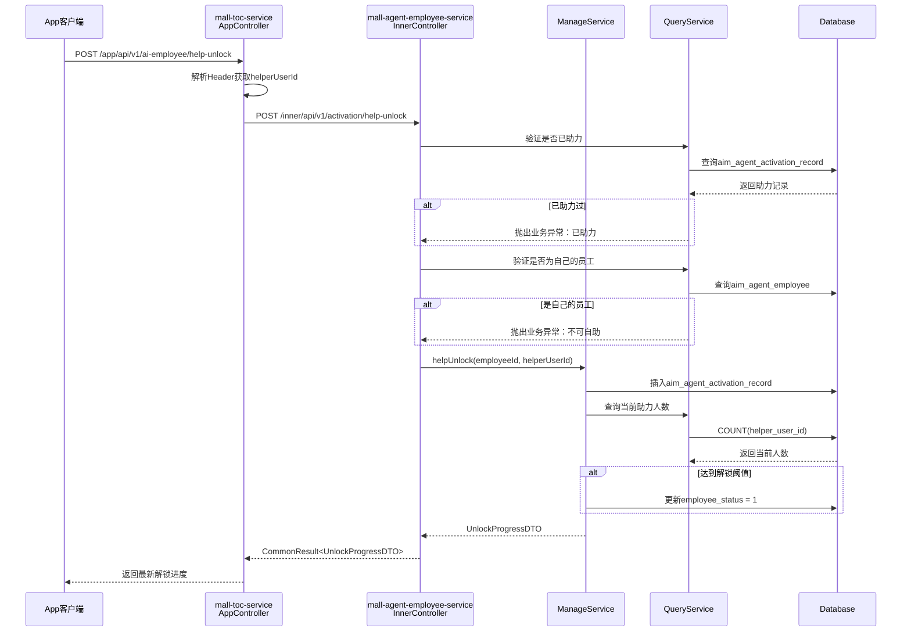
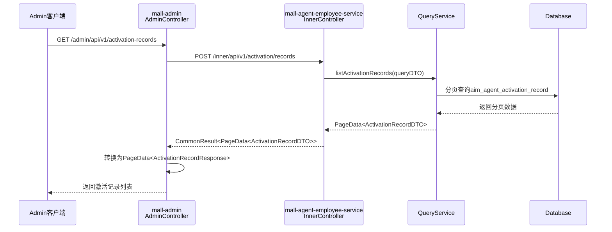
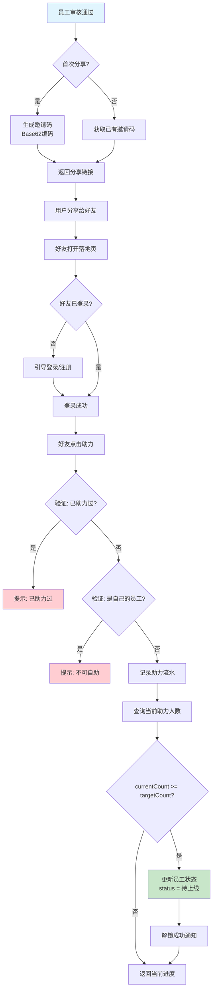
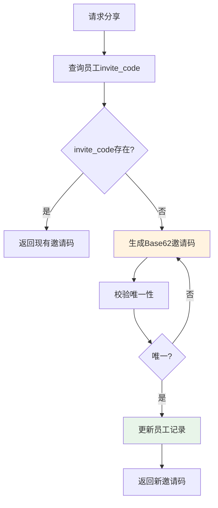
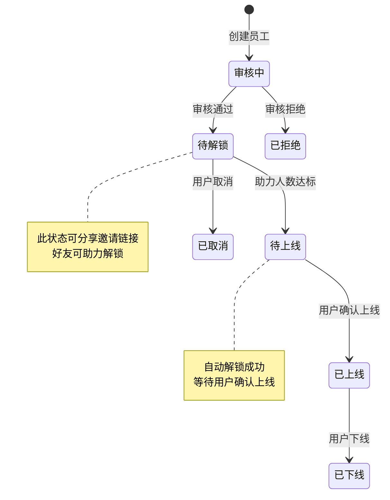

# Feature 技术规格: F-007 智能员工解锁与激活

## 1. 基本信息

| 属性 | 值 |
|------|-----|
| Feature ID | F-007 |
| Feature 名称 | 智能员工解锁与激活 |
| 领域 | 员工生命周期域 |
| 模块 | mall-agent-employee-service |
| 优先级 | P0 |
| 描述 | 审核通过后用户分享邀请链接，好友助力后计入解锁进度，达到人数后自动激活 |

---

## 2. API 接口定义

### 2.1 App 端接口

| 接口名称 | 路径 | 方法 | 描述 | 响应类型 |
|----------|------|------|------|----------|
| getUnlockProgress | `/app/api/v1/ai-employee/{employeeId}/unlock-progress` | GET | 查询解锁进度 | UnlockProgressResponse |
| share | `/app/api/v1/ai-employee/{employeeId}/share` | POST | 分享邀请链接 | ShareResponse |
| getUnlockDetail | `/app/api/v1/ai-employee/unlock-detail` | GET | 落地页详情查询（根据 inviteCode，无需登录） | UnlockDetailResponse |
| helpUnlock | `/app/api/v1/ai-employee/help-unlock` | POST | 帮助好友助力解锁 | UnlockProgressResponse |

### 2.2 Admin 端接口

| 接口名称 | 路径 | 方法 | 描述 | 响应类型 |
|----------|------|------|------|----------|
| listActivationRecords | `/admin/api/v1/activation-records` | GET | 激活记录列表查询 | PageData\<ActivationRecordResponse\> |
| getActivationConfig | `/admin/api/v1/activation-config` | GET | 获取激活配置 | ActivationConfigResponse |
| saveActivationConfig | `/admin/api/v1/activation-config` | PUT | 保存激活配置 | Void |

### 2.3 Inner 内部接口

| 接口名称 | 路径 | 方法 | 描述 | 响应类型 |
|----------|------|------|------|----------|
| getUnlockProgress | `/inner/api/v1/activation/progress` | GET | 查询解锁进度 | CommonResult\<UnlockProgressDTO\> |
| getInviteCode | `/inner/api/v1/activation/invite-code` | GET | 获取邀请码 | CommonResult\<String\> |
| getUnlockDetail | `/inner/api/v1/activation/unlock-detail` | GET | 获取解锁详情（落地页） | CommonResult\<UnlockDetailDTO\> |
| helpUnlock | `/inner/api/v1/activation/help-unlock` | POST | 帮助解锁 | CommonResult\<UnlockProgressDTO\> |
| listActivationRecords | `/inner/api/v1/activation/records` | POST | 激活记录列表 | CommonResult\<PageData\<ActivationRecordDTO\>\> |

---

## 3. 数据库设计

### 3.1 新增表：aim_agent_activation_record（智能员工激活记录流水表）

> **删除策略**: 软删除（`is_deleted`，0=未删除，1=已删除）

| 字段名 | 类型 | 是否必填 | 描述 |
|--------|------|----------|------|
| id | BIGINT | 是 | 主键ID |
| employee_id | BIGINT | 是 | 智能员工ID |
| employee_no | VARCHAR(32) | 是 | 员工编号 |
| employee_name | VARCHAR(64) | 是 | 员工名称 |
| inviter_user_id | BIGINT | 是 | 邀请人用户ID |
| helper_user_id | BIGINT | 是 | 助力人用户ID |
| is_deleted | TINYINT | 是 | 是否删除（0-否，1-是） |
| create_time | DATETIME | 是 | 创建时间 |

**索引设计**：
- `idx_employee_id`：员工ID索引
- `idx_inviter_user_id`：邀请人用户ID索引
- `uk_employee_helper`：唯一索引（employee_id + helper_user_id），防止重复助力

### 3.2 扩展表：aim_agent_employee（智能员工表扩展字段）

| 字段名 | 类型 | 是否必填 | 描述 |
|--------|------|----------|------|
| invite_code | VARCHAR(16) | 否 | 邀请码（Base62编码，懒生成） |

**说明**：邀请码采用懒加载策略，首次分享时生成并存储。

---

## 4. 业务规则

### 4.1 解锁阈值配置

| 规则项 | 配置键 | 默认值 | 说明 |
|--------|--------|--------|------|
| 解锁所需人数 | QUOTA.UNLOCK_PERSON_COUNT | 3 | 达到该人数后自动激活 |

### 4.2 助力限制配置

| 规则项 | 配置键 | 默认值 | 说明 |
|--------|--------|--------|------|
| 单用户最大助力次数 | ACTIVATION.MAX_HELP_PER_USER | 0 | 0表示不限制 |

### 4.3 邀请码生成规则

| 属性 | 值 |
|------|-----|
| 算法 | Base62 编码 |
| 数据源 | employeeId |
| 长度 | 最多16位 |
| 生成时机 | 首次分享时懒加载生成 |

### 4.4 防重复助力规则

| 规则 | 描述 |
|------|------|
| 防重复 | 同一用户对同一员工只能助力一次 |
| 禁止自助 | 用户不可为自己的员工助力 |

### 4.5 自动解锁触发

| 条件 | 动作 |
|------|------|
| currentCount >= targetCount | 更新 employee_status = 1（待上线状态） |

---

## 5. 时序图

### 5.1 查询解锁进度时序图



### 5.2 分享邀请链接时序图



### 5.3 帮助解锁时序图



### 5.4 Admin 激活记录查询时序图



---

## 6. 业务流程图

### 6.1 智能员工解锁激活完整流程



### 6.2 邀请码生成流程



### 6.3 助力解锁状态流转



---

## 7. DTO 定义

### 7.1 Request DTO

#### HelpUnlockRequest

| 字段名 | 类型 | 必填 | 描述 |
|--------|------|------|------|
| inviteCode | String | 是 | 邀请码 |

#### ActivationRecordQueryRequest

| 字段名 | 类型 | 必填 | 描述 |
|--------|------|------|------|
| employeeId | Long | 否 | 员工ID |
| employeeNo | String | 否 | 员工编号 |
| employeeName | String | 否 | 员工名称（模糊查询） |
| inviterUserId | Long | 否 | 邀请人ID |
| startTime | LocalDateTime | 否 | 创建时间开始 |
| endTime | LocalDateTime | 否 | 创建时间结束 |
| pageNo | Integer | 是 | 页码 |
| pageSize | Integer | 是 | 每页大小 |

### 7.2 Response DTO

#### UnlockProgressResponse

| 字段名 | 类型 | 描述 |
|--------|------|------|
| employeeId | Long | 员工ID |
| employeeName | String | 员工名称 |
| currentCount | Integer | 当前助力人数 |
| targetCount | Integer | 目标人数 |
| progress | Integer | 进度百分比 |
| isUnlocked | Boolean | 是否已解锁 |
| inviteCode | String | 邀请码 |
| shareUrl | String | 分享链接 |

#### ShareResponse

| 字段名 | 类型 | 描述 |
|--------|------|------|
| inviteCode | String | 邀请码 |
| shareUrl | String | 分享链接 |
| shareTitle | String | 分享标题 |
| shareDesc | String | 分享描述 |

#### UnlockDetailResponse

| 字段名 | 类型 | 描述 |
|--------|------|------|
| employeeId | Long | 员工ID |
| employeeName | String | 员工名称 |
| employeeNo | String | 员工编号 |
| currentCount | Integer | 当前助力人数 |
| targetCount | Integer | 目标人数 |
| inviterName | String | 邀请人名称 |
| hasHelped | Boolean | 当前用户是否已助力 |

#### ActivationRecordResponse

| 字段名 | 类型 | 描述 |
|--------|------|------|
| id | Long | 记录ID |
| employeeId | Long | 员工ID |
| employeeNo | String | 员工编号 |
| employeeName | String | 员工名称 |
| inviterUserId | Long | 邀请人ID |
| inviterName | String | 邀请人名称 |
| helperUserId | Long | 助力人ID |
| helperName | String | 助力人名称 |
| createTime | LocalDateTime | 创建时间 |

#### ActivationConfigResponse

| 字段名 | 类型 | 描述 |
|--------|------|------|
| unlockPersonCount | Integer | 解锁所需人数 |
| maxHelpPerUser | Integer | 单用户最大助力次数 |

---

## 8. 实现层顺序

```
生成顺序：
1. Feign 接口（mall-inner-api）
   - RemoteActivationService
   - DTO 定义

2. 应用服务层（mall-agent-employee-service）
   - ActivationRecordDO
   - ActivationRecordMapper
   - ActivationQueryService
   - ActivationManageService
   - ActivationApplicationService
   - InnerActivationController

3. 门面服务层（mall-toc-service / mall-admin）
   - Request/Response DTO
   - ActivationAppService
   - ActivationAdminController
   - ActivationAppController

4. 数据库脚本
   - schema.sql
   - test-data.sql

5. HTTP 测试文件
   - activation-api.http
```

---

## 9. 规范合规性检查清单

### 9.1 门面 Controller 检查项

| 检查项 | 状态 | 说明 |
|--------|------|------|
| @Valid 校验 | ⬜ | Request DTO 需添加 @Valid 校验 |
| Header 解析 | ⬜ | 从 Header 解析 userId、userName 等信息 |
| ApplicationService 调用 | ⬜ | 通过 Feign 调用内部服务 |
| Response DTO 转换 | ⬜ | 返回前端友好的 Response 对象 |
| 异常处理 | ⬜ | 统一异常处理，返回友好错误信息 |
| 日志记录 | ⬜ | 关键操作记录日志 |

### 9.2 内部 Controller 检查项

| 检查项 | 状态 | 说明 |
|--------|------|------|
| 手动参数校验 | ⬜ | 使用 Assert 或手动校验必填参数 |
| @RequestParam 注解 | ⬜ | GET 请求使用 @RequestParam |
| @RequestBody 注解 | ⬜ | POST 请求使用 @RequestBody |
| CommonResult 包装 | ⬜ | 返回值统一使用 CommonResult |
| Query/ManageService 调用 | ⬜ | 遵循读写分离原则 |

### 9.3 ApplicationService 检查项

| 检查项 | 状态 | 说明 |
|--------|------|------|
| String 去空格 | ⬜ | 入参 String 类型调用 trim() |
| DTO 转换 | ⬜ | DO 与 DTO 之间正确转换 |
| 分层合规 | ⬜ | 不直接操作 Mapper，通过 Service 层 |
| 事务控制 | ⬜ | 写操作添加 @Transactional |

### 9.4 QueryService 检查项

| 检查项 | 状态 | 说明 |
|--------|------|------|
| 只读操作 | ⬜ | 仅包含查询方法，无写操作 |
| 原生 SQL | ⬜ | 复杂查询使用原生 SQL |
| 分页处理 | ⬜ | 使用 PageHelper 分页 |

### 9.5 ManageService 检查项

| 检查项 | 状态 | 说明 |
|--------|------|------|
| MP 增删改 | ⬜ | 使用 MyBatis-Plus 进行数据操作 |
| 业务校验 | ⬜ | 写操作前进行业务规则校验 |
| 事务注解 | ⬜ | 添加 @Transactional 注解 |

### 9.6 DO 实体检查项

| 检查项 | 状态 | 说明 |
|--------|------|------|
| 继承 BaseDO | ⬜ | 继承框架提供的 BaseDO |
| 字段对应 | ⬜ | 字段与数据库表一致 |
| 注解配置 | ⬜ | @TableName、@TableId 等注解正确 |

### 9.7 Mapper 检查项

| 检查项 | 状态 | 说明 |
|--------|------|------|
| Base_Column_List | ⬜ | XML 中定义 Base_Column_List |
| 禁止 SELECT * | ⬜ | 明确列出查询字段 |
| 索引使用 | ⬜ | 查询条件使用索引字段 |

### 9.8 Feign 接口检查项

| 检查项 | 状态 | 说明 |
|--------|------|------|
| @FeignClient 注解 | ⬜ | 正确配置服务名称 |
| @RequestParam 注解 | ⬜ | GET 参数使用 @RequestParam |
| @RequestBody 注解 | ⬜ | POST 参数使用 @RequestBody |
| CommonResult 返回 | ⬜ | 返回值使用 CommonResult 包装 |
| 路径规范 | ⬜ | 路径以 /inner/api/v1 开头 |

---

## 10. 风险与注意事项

| 风险点 | 影响 | 缓解措施 |
|--------|------|----------|
| 邀请码冲突 | 用户无法正常分享 | Base62 编码 + 唯一性校验 |
| 重复助力 | 数据不一致 | 数据库唯一索引 + 业务校验 |
| 并发助力 | 超过阈值 | 乐观锁 / 分布式锁 |
| 配置缺失 | 功能异常 | 提供默认值兜底 |

---

## 11. 版本信息

| 属性 | 值 |
|------|-----|
| 文档版本 | v1.0 |
| 创建时间 | 2026-03-16 |
| 最后更新 | 2026-03-16 |
| 作者 | AI Coding Assistant |
