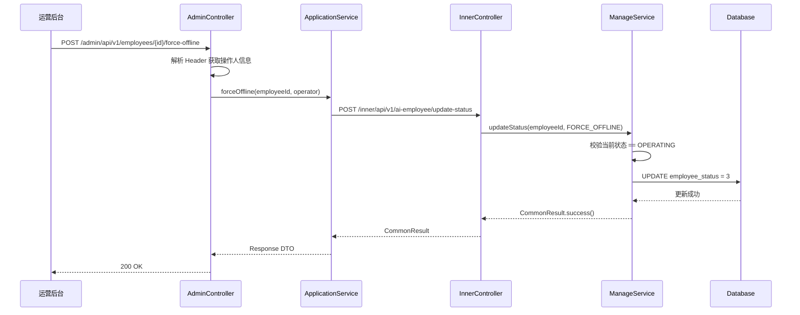
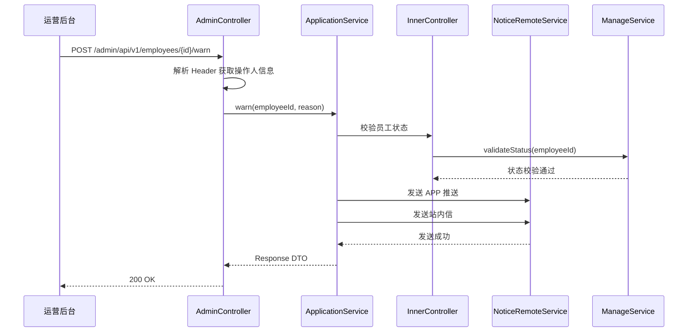
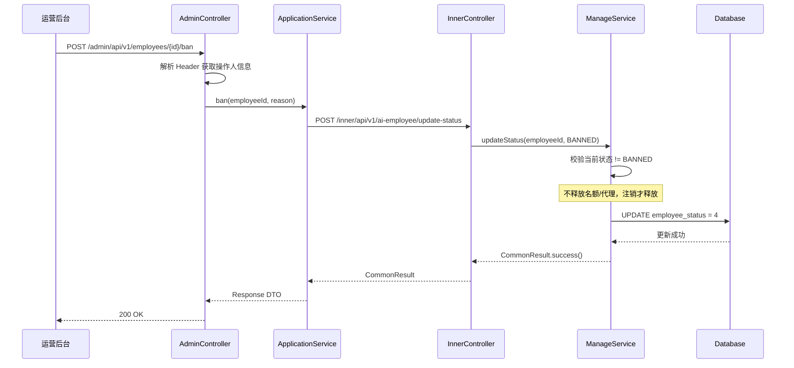
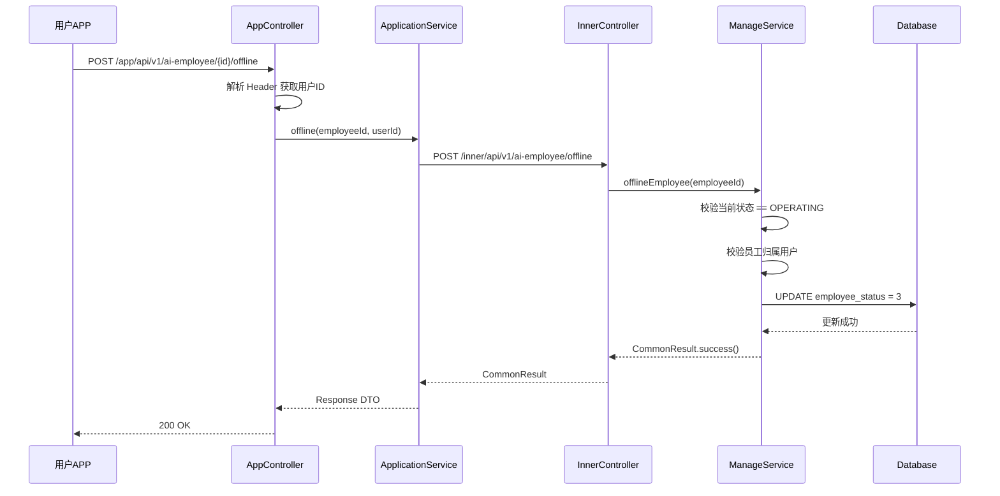
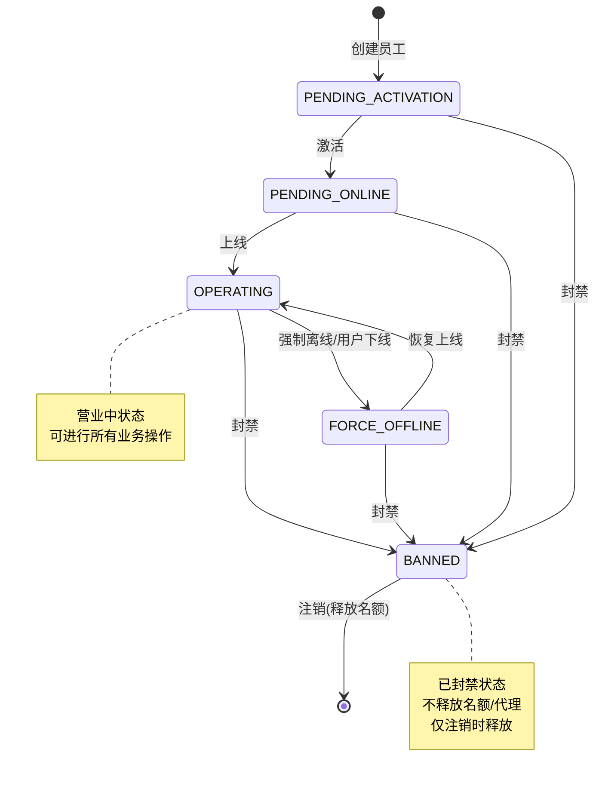
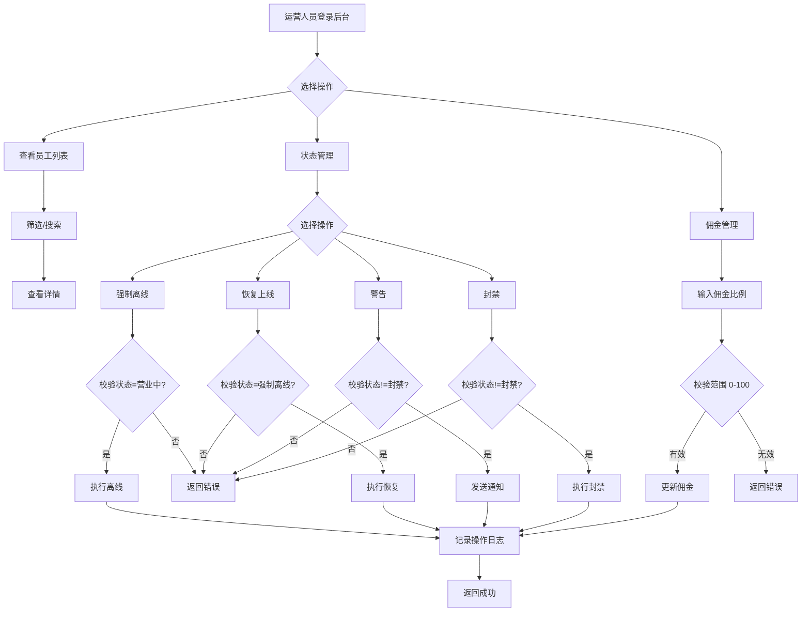
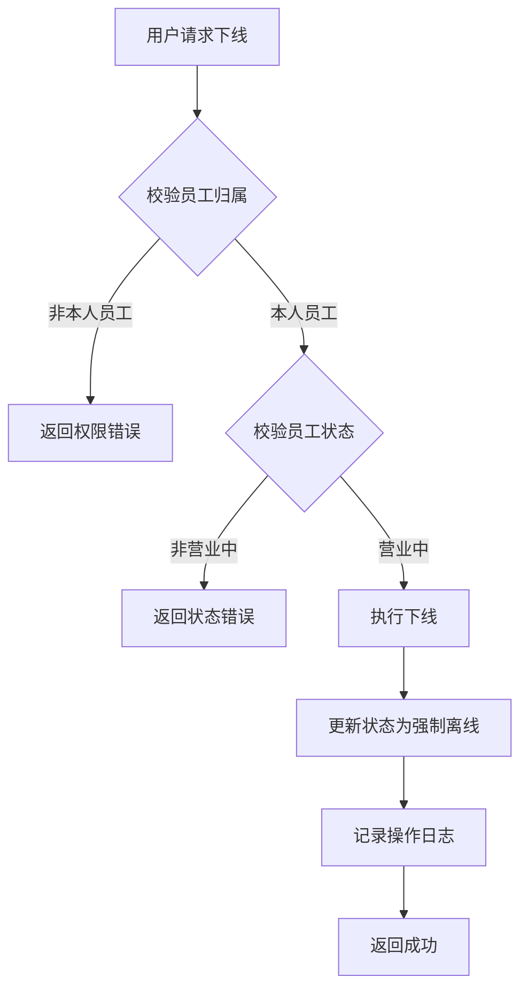

# Feature 技术规格: F-008 智能员工运营管理

## 1. Feature 概述

| 属性 | 值 |
|------|-----|
| **Feature ID** | F-008 |
| **Feature 名称** | 智能员工运营管理 |
| **所属域** | 员工生命周期域 |
| **所属模块** | mall-agent-employee-service |
| **优先级** | P0 |
| **描述** | 运营人员管理所有智能员工，支持状态变更操作 |

---

## 2. API 接口定义

### 2.1 内部接口 (Inner APIs)

| 接口名称 | 路径 | 说明 |
|----------|------|------|
| listEmployees | `/inner/api/v1/ai-employee/list` | 查询员工列表 |
| getEmployeeStats | `/inner/api/v1/ai-employee/stats` | 获取员工统计数据 |
| updateEmployeeStatus | `/inner/api/v1/ai-employee/update-status` | 更新员工状态 |
| updateCommissionRate | `/inner/api/v1/ai-employee/update-commission` | 更新佣金比例 |
| offlineEmployee | `/inner/api/v1/ai-employee/offline` | 员工下线 |
| getEmployeeEnums | `/inner/api/v1/ai-employee/enums` | 获取枚举值 |

### 2.2 门面接口 - Admin (Facade APIs)

| 接口名称 | 路径 | 说明 |
|----------|------|------|
| list | `/admin/api/v1/employees` | 员工列表查询 |
| getDetail | `/admin/api/v1/employees/{employeeId}/detail` | 员工详情 |
| forceOffline | `/admin/api/v1/employees/{employeeId}/force-offline` | 强制离线 |
| resume | `/admin/api/v1/employees/{employeeId}/resume` | 恢复上线 |
| warn | `/admin/api/v1/employees/{employeeId}/warn` | 警告员工 |
| ban | `/admin/api/v1/employees/{employeeId}/ban` | 封禁员工 |
| updateCommission | `/admin/api/v1/employees/{employeeId}/commission` | 更新佣金 |

### 2.3 应用接口 - App (App APIs)

| 接口名称 | 路径 | 说明 |
|----------|------|------|
| getDetail | `/app/api/v1/ai-employee/{employeeId}/detail` | 员工详情（用户端） |
| offline | `/app/api/v1/ai-employee/{employeeId}/offline` | 用户主动下线 |

---

## 3. 数据模型

### 3.1 智能员工主表 (aim_agent_employee)

> **说明**: F-006 已定义基础结构，F-008 扩展状态字段
> **删除策略**: 时间戳软删除（`deleted_at`，NULL=未注销）

#### 员工状态枚举 (employee_status)

| 枚举值 | 名称 | 说明 |
|--------|------|------|
| 0 | PENDING_ACTIVATION | 待激活 |
| 1 | PENDING_ONLINE | 待上线 |
| 2 | OPERATING | 营业中 |
| 3 | FORCE_OFFLINE | 强制离线 |
| 4 | BANNED | 已封禁 |
| 5 | CANCELLED | 已注销（deleted_at 非空） |

### 3.2 员工统计汇总表 (aim_agent_employee_stats)

> **说明**: F-008 新增表

| 字段名 | 类型 | 说明 |
|--------|------|------|
| id | BIGINT | 主键ID |
| employee_id | BIGINT | 员工ID |
| consult_count | BIGINT | 咨询次数 |
| total_revenue | DECIMAL(15,2) | 总营收 |
| total_commission | DECIMAL(15,2) | 总佣金 |

---

## 4. 业务规则

### 4.1 状态转换规则

| 操作 | 源状态 | 目标状态 | 备注 |
|------|--------|----------|------|
| 强制离线 | 2（营业中） | 3（强制离线） | 运营人员操作 |
| 恢复上线 | 3（强制离线） | 2（营业中） | 运营人员操作 |
| 警告 | 任意非封禁状态 | - | 调用 NoticeRemoteService 发送 APP 推送+站内信 |
| 封禁 | 任意非封禁状态(!=4) | 4（已封禁） | 不释放名额/代理，注销才释放 |
| 用户主动下线 | 2（营业中） | 3（强制离线） | 用户端操作 |

### 4.2 佣金比例规则

| 规则项 | 值 |
|--------|-----|
| 佣金比例范围 | 0.00 ~ 100.00 |
| 单位 | 百分比 |

---

## 5. 接口调用时序图

### 5.1 强制离线时序图

### 5.2 警告员工时序图

### 5.3 封禁员工时序图

### 5.4 用户主动下线时序图

---

## 6. 业务流程图

### 6.1 员工状态流转图

### 6.2 运营管理操作流程

### 6.3 用户端下线流程

---

## 7. 规范合规性检查清单

### 7.1 门面 Controller (Admin/App) 检查项

| 检查项 | 要求 | 状态 |
|--------|------|------|
| 参数校验 | 使用 `@Valid` 注解校验 Request DTO | ⬜ |
| Header 解析 | 从 Header 解析操作人/用户信息 | ⬜ |
| DTO 转换 | 使用 MapStruct 或手动转换 DTO | ⬜ |
| Response 封装 | 返回标准 Response DTO | ⬜ |
| 异常处理 | 统一异常处理，返回标准错误码 | ⬜ |
| 日志记录 | 记录关键操作日志 | ⬜ |

### 7.2 内部 Controller (Inner) 检查项

| 检查项 | 要求 | 状态 |
|--------|------|------|
| 参数校验 | 手动校验必填参数 | ⬜ |
| 参数注解 | 使用 `@RequestParam` 注解 | ⬜ |
| Service 调用 | 调用 QueryService/ManageService | ⬜ |
| 返回值 | 返回 `CommonResult<T>` | ⬜ |
| 事务控制 | 写操作添加 `@Transactional` | ⬜ |

### 7.3 ApplicationService 检查项

| 检查项 | 要求 | 状态 |
|--------|------|------|
| 字符串处理 | String 类型参数调用 `trim()` | ⬜ |
| DTO 转换 | DO ↔ DTO 转换在 Service 层完成 | ⬜ |
| 分层合规 | 不直接调用 Mapper，通过 Service 层 | ⬜ |
| 业务校验 | 业务规则校验在 Service 层实现 | ⬜ |

### 7.4 QueryService 检查项

| 检查项 | 要求 | 状态 |
|--------|------|------|
| 只读操作 | 仅包含查询方法 | ⬜ |
| SQL 规范 | 使用原生 SQL 或 MyBatis-Plus 查询 | ⬜ |
| 分页支持 | 列表查询支持分页 | ⬜ |

### 7.5 ManageService 检查项

| 检查项 | 要求 | 状态 |
|--------|------|------|
| 写操作 | 包含增删改方法 | ⬜ |
| MP 规范 | 使用 MyBatis-Plus 进行数据操作 | ⬜ |
| 业务校验 | 写操作前进行业务规则校验 | ⬜ |
| 事务控制 | 方法级别 `@Transactional` | ⬜ |

### 7.6 DO 实体检查项

| 检查项 | 要求 | 状态 |
|--------|------|------|
| 基类继承 | 继承 `BaseDO` | ⬜ |
| 字段映射 | 数据库字段与 DO 字段一一对应 | ⬜ |
| 注解配置 | 正确使用 `@TableName`, `@TableField` | ⬜ |

### 7.7 Mapper 检查项

| 检查项 | 要求 | 状态 |
|--------|------|------|
| Base_Column_List | 定义基础列列表 | ⬜ |
| 禁止 SELECT * | SQL 中明确列出字段 | ⬜ |
| 继承 BaseMapper | 继承 MyBatis-Plus BaseMapper | ⬜ |

### 7.8 Feign 接口检查项

| 检查项 | 要求 | 状态 |
|--------|------|------|
| @FeignClient | 正确配置服务名称 | ⬜ |
| @RequestParam | 使用 `@RequestParam` 注解参数 | ⬜ |
| 返回值 | 返回 `CommonResult<T>` | ⬜ |
| 超时配置 | 配置合理的超时时间 | ⬜ |

---

## 8. 依赖服务

| 服务名 | 用途 | 调用方式 |
|--------|------|----------|
| NoticeRemoteService | 发送 APP 推送、站内信 | Feign |
| UserRemoteService | 用户信息查询 | Feign |

---

## 9. 文件生成清单

### 9.1 Feign 接口 (mall-inner-api)

| 文件类型 | 文件名 | 说明 |
|----------|--------|------|
| RemoteService | AgentEmployeeRemoteService | 员工远程接口 |
| DTO | AgentEmployeeListRequest | 列表查询请求 |
| DTO | AgentEmployeeListResponse | 列表查询响应 |
| DTO | AgentEmployeeStatsResponse | 统计数据响应 |
| DTO | AgentEmployeeDetailResponse | 详情响应 |

### 9.2 应用服务层 (mall-agent-employee-service)

| 文件类型 | 文件名 | 说明 |
|----------|--------|------|
| DO | AgentEmployeeStatsDO | 统计表实体 |
| Mapper | AgentEmployeeStatsMapper | 统计表 Mapper |
| Mapper XML | AgentEmployeeStatsMapper.xml | Mapper XML |
| QueryService | AgentEmployeeQueryService | 查询服务 |
| ManageService | AgentEmployeeManageService | 管理服务 |
| InnerController | AgentEmployeeInnerController | 内部接口控制器 |

### 9.3 门面服务层 (mall-admin)

| 文件类型 | 文件名 | 说明 |
|----------|--------|------|
| DTO | EmployeeListRequest | 列表请求 |
| DTO | EmployeeListResponse | 列表响应 |
| DTO | EmployeeDetailResponse | 详情响应 |
| DTO | EmployeeOperationRequest | 操作请求 |
| ApplicationService | AgentEmployeeApplicationService | 应用服务 |
| Controller | AgentEmployeeAdminController | Admin 控制器 |

### 9.4 数据库脚本

| 文件名 | 说明 |
|--------|------|
| schema.sql | 建表语句 |
| test-data.sql | 测试数据 |

### 9.5 HTTP 测试文件

| 文件名 | 说明 |
|--------|------|
| agent-employee-admin.http | Admin 接口测试 |
| agent-employee-app.http | App 接口测试 |
| agent-employee-inner.http | Inner 接口测试 |

---

## 10. 版本信息

| 项目 | 值 |
|------|-----|
| 文档版本 | v1.0 |
| 创建日期 | 2026-03-16 |
| 最后更新 | 2026-03-16 |
| 作者 | AI Code Generator |
