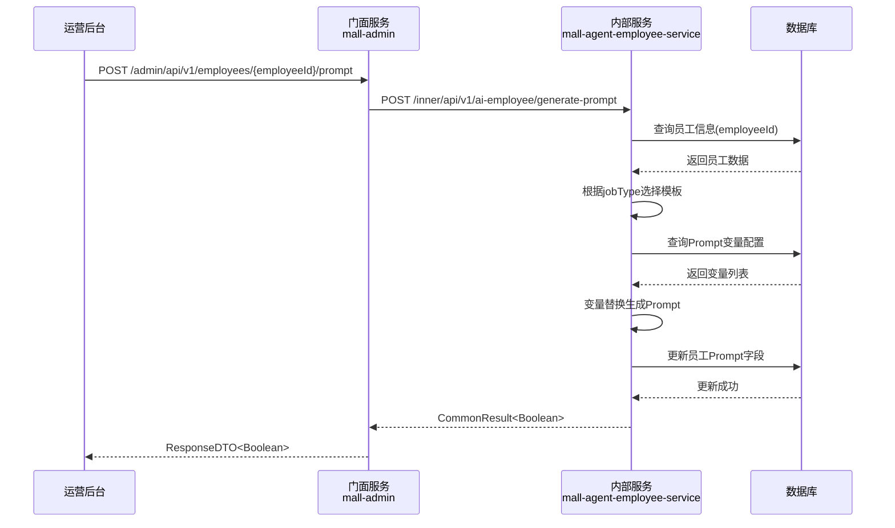
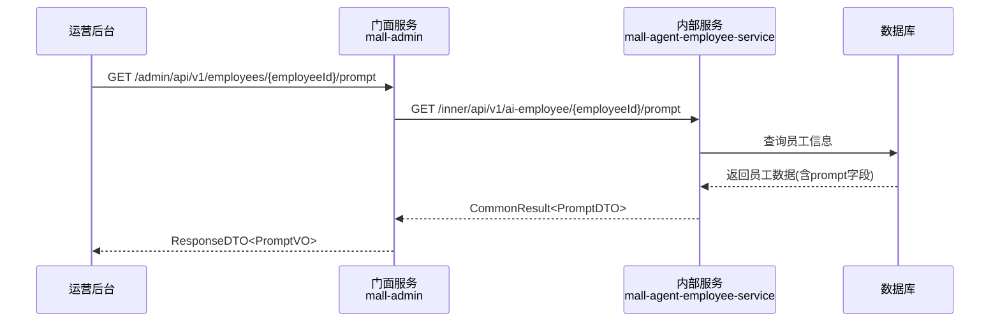
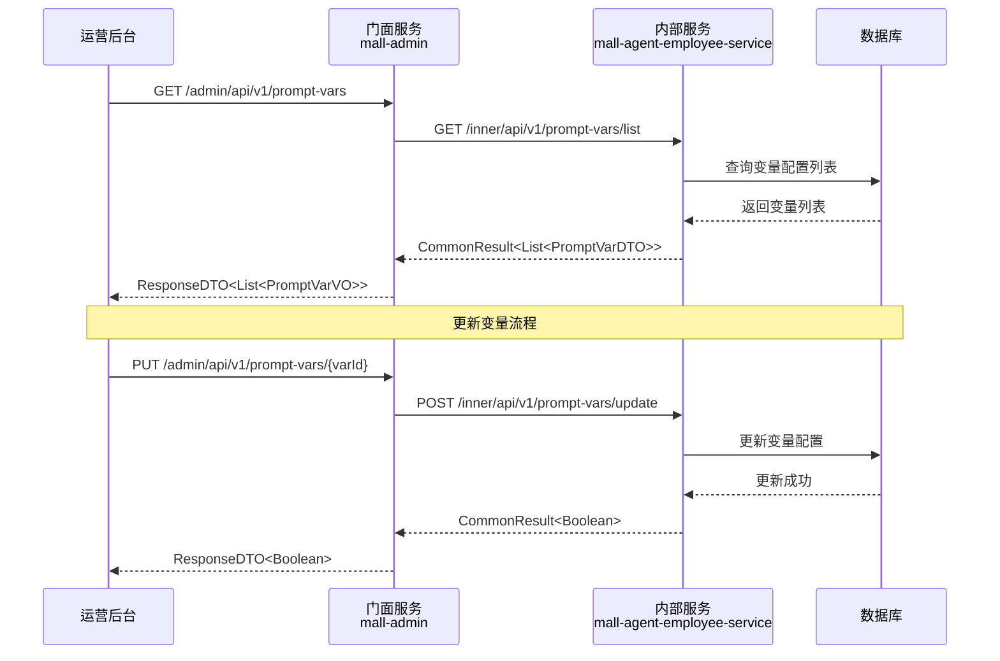
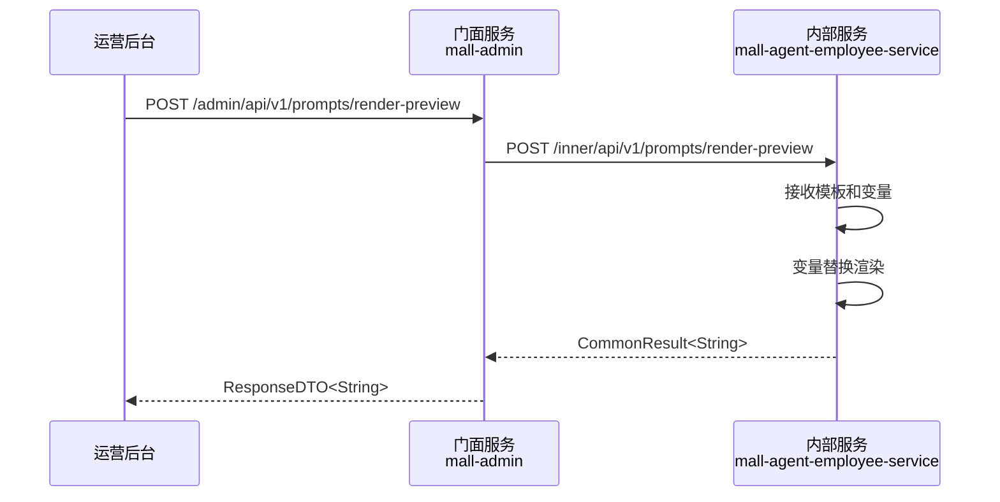
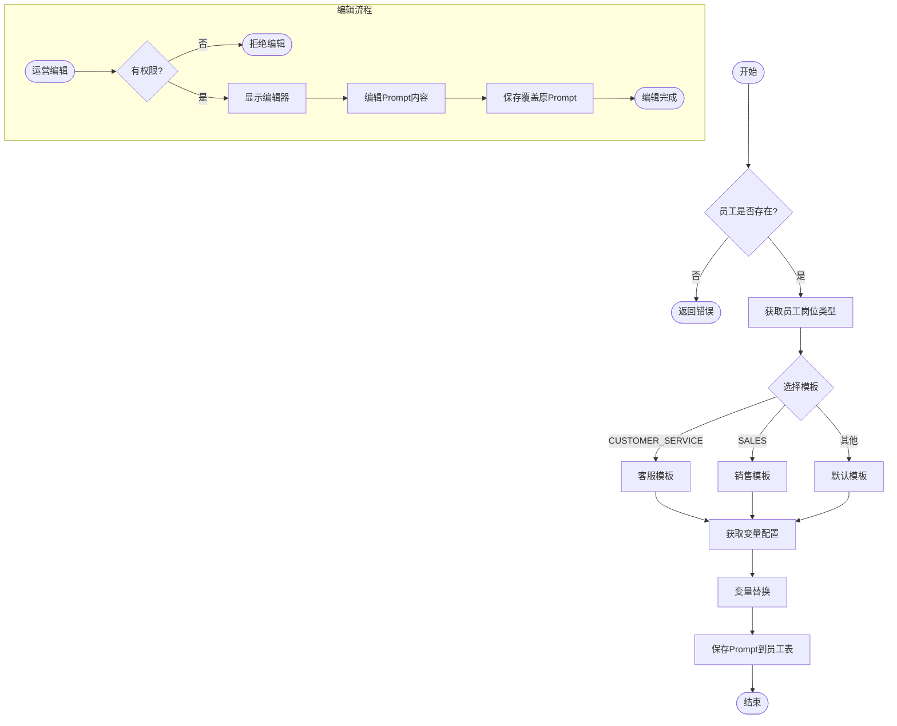
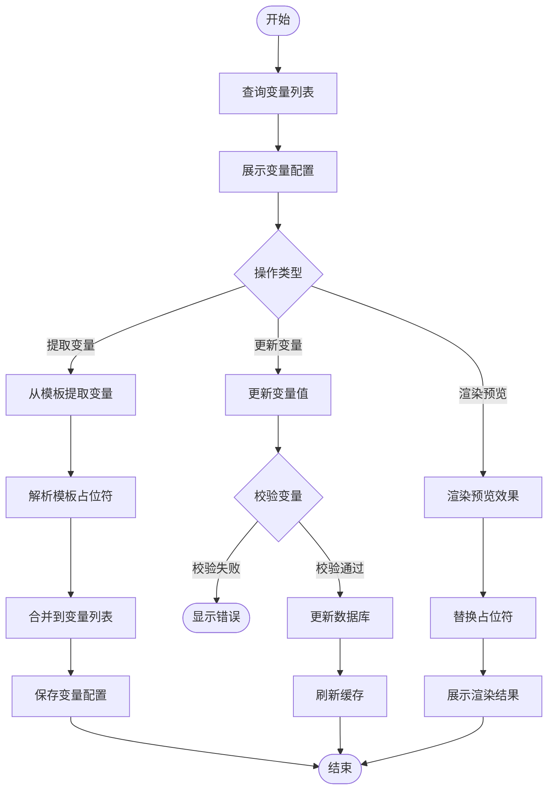
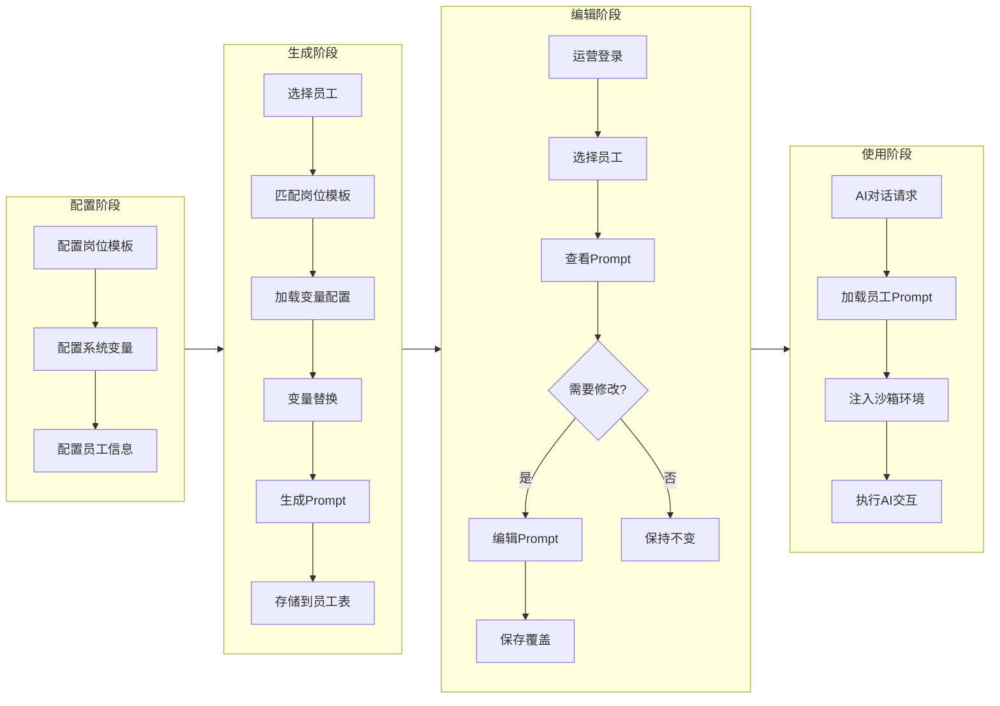

# Feature 技术规格: F-009 - Prompt管理与生成

## 1. 基本信息

| 属性 | 值 |
|------|-----|
| Feature ID | F-009 |
| Feature 名称 | Prompt管理与生成 |
| 领域 | 员工生命周期域 |
| 所属模块 | mall-agent-employee-service |
| 优先级 | P0 |
| 描述 | 系统根据员工配置动态生成Prompt，运营人员可直接编辑 |

---

## 2. API 接口定义

### 2.1 门面服务 API (Facade)

#### Admin API (运营后台)

| 接口名称 | 路径 | 说明 |
|----------|------|------|
| getPromptPreview | `/admin/api/v1/employees/{employeeId}/prompt` | 获取员工Prompt预览 |
| updatePrompt | `/admin/api/v1/employees/{employeeId}/prompt` | 更新员工Prompt |
| listPromptVars | `/admin/api/v1/prompt-vars` | 查询Prompt变量列表 |
| updatePromptVar | `/admin/api/v1/prompt-vars/{varId}` | 更新Prompt变量 |
| extractVarsFromTemplate | `/admin/api/v1/prompts/extract-vars` | 从模板提取变量 |
| renderPreview | `/admin/api/v1/prompts/render-preview` | 渲染Prompt预览 |

#### App API (C端应用)

| 接口名称 | 路径 | 说明 |
|----------|------|------|
| getPromptPreview | `/app/api/v1/ai-employee/{employeeId}/prompt` | 获取员工Prompt预览 |

### 2.2 内部服务 API (Inner)

| 接口名称 | 路径 | 说明 |
|----------|------|------|
| generatePrompt | `/inner/api/v1/ai-employee/generate-prompt` | 生成员工Prompt |
| getPromptByEmployeeId | `/inner/api/v1/ai-employee/{employeeId}/prompt` | 根据员工ID获取Prompt |
| updatePrompt | `/inner/api/v1/ai-employee/prompt` | 更新Prompt |
| listPromptVars | `/inner/api/v1/prompt-vars/list` | 查询变量列表 |
| updatePromptVar | `/inner/api/v1/prompt-vars/update` | 更新变量 |
| extractVars | `/inner/api/v1/prompts/extract-vars` | 提取变量 |
| renderPreview | `/inner/api/v1/prompts/render-preview` | 渲染预览 |

---

## 3. 数据库设计

### 3.1 aim_agent_prompt_vars (Prompt变量配置表)

| 字段名 | 类型 | 说明 |
|--------|------|------|
| id | BIGINT | 主键ID |
| var_key | VARCHAR(100) | 变量键 |
| var_value | VARCHAR(500) | 变量值 |
| description | VARCHAR(200) | 变量描述 |
| sort_order | INT | 排序序号 |
| status | TINYINT | 状态 |
| create_time | DATETIME | 创建时间 |
| update_time | DATETIME | 更新时间 |
| is_deleted | TINYINT | 删除标记 |

### 3.2 aim_agent_employee (员工表 - 扩展字段)

| 字段名 | 类型 | 说明 |
|--------|------|------|
| prompt | TEXT | 最终生成的Prompt内容（F-009填充） |

---

## 4. 业务规则

### 4.1 Prompt生成规则

| 配置项 | 值 |
|--------|-----|
| 模板策略 | hardcoded (硬编码) |

#### 模板配置

| 岗位类型代码 | 模板内容 |
|--------------|----------|
| CUSTOMER_SERVICE | 你是PLATFORM_NAME的客服助手employeeName，styleName。请用专业友好的语气帮助用户解决问题。 |
| SALES | 你是PLATFORM_NAME的销售顾问employeeName，styleName。请根据用户需求推荐适合的商品。 |
| DEFAULT | 你是PLATFORM_NAME的助手employeeName，styleName。 |

### 4.2 Prompt编辑规则

| 配置项 | 值 |
|--------|-----|
| 权限角色 | admin |
| 权限操作 | 编辑任意员工Prompt |
| 覆盖规则 | 编辑后覆盖自动生成的内容，不保留历史版本 |

### 4.3 变量管理

#### 预定义变量

| 变量键 | 变量值 |
|--------|--------|
| PLATFORM_NAME | AI智能导购平台 |
| DEFAULT_GREETING | 您好，我是您的专属导购助手 |

### 4.4 沙箱规则

| 配置项 | 值 |
|--------|-----|
| 服务提供方 | mall-ai |
| 存储类型 | memory |
| 存储后端 | Redis |
| TTL | 1800秒 (30分钟) |

---

## 5. 时序图

### 5.1 Prompt生成时序图

### 5.2 Prompt预览时序图

### 5.3 Prompt变量管理时序图

### 5.4 Prompt渲染预览时序图

---

## 6. 业务流程图

### 6.1 Prompt生成与编辑流程

### 6.2 Prompt变量管理流程

### 6.3 完整业务流程

---

## 7. 规范合规性检查清单

### 7.1 门面服务 (Facade) 检查项

| 检查项 | 要求 | 状态 |
|--------|------|------|
| Controller 注解 | 使用 @RestController | ⬜ 待检查 |
| 请求映射 | 使用 @RequestMapping 定义路径前缀 | ⬜ 待检查 |
| 参数校验 | 使用 @Valid 注解进行参数校验 | ⬜ 待检查 |
| Header 解析 | 正确解析请求头信息 | ⬜ 待检查 |
| 响应封装 | 返回 ResponseDTO 包装响应 | ⬜ 待检查 |
| 异常处理 | 统一异常处理机制 | ⬜ 待检查 |
| 日志记录 | 关键操作记录日志 | ⬜ 待检查 |

### 7.2 内部服务 (Inner) 检查项

| 检查项 | 要求 | 状态 |
|--------|------|------|
| Controller 注解 | 使用 @RestController | ⬜ 待检查 |
| 路径前缀 | 使用 /inner/api/v1 前缀 | ⬜ 待检查 |
| 参数注解 | 使用 @RequestParam 注解 | ⬜ 待检查 |
| 响应封装 | 返回 CommonResult 包装响应 | ⬜ 待检查 |
| 参数校验 | 手动校验必填参数 | ⬜ 待检查 |
| 服务调用 | 调用 QueryService/ManageService | ⬜ 待检查 |

### 7.3 ApplicationService 检查项

| 检查项 | 要求 | 状态 |
|--------|------|------|
| 字符串处理 | String 类型参数去除前后空格 | ⬜ 待检查 |
| DTO 转换 | 正确进行 DO/DTO 转换 | ⬜ 待检查 |
| 分层合规 | 不直接操作 Mapper | ⬜ 待检查 |
| 事务管理 | 写操作添加 @Transactional | ⬜ 待检查 |

### 7.4 QueryService 检查项

| 检查项 | 要求 | 状态 |
|--------|------|------|
| 只读操作 | 仅包含查询方法 | ⬜ 待检查 |
| SQL 规范 | 使用原生 SQL 查询 | ⬜ 待检查 |
| 返回类型 | 返回 DO 或基础类型 | ⬜ 待检查 |

### 7.5 ManageService 检查项

| 检查项 | 要求 | 状态 |
|--------|------|------|
| 写操作 | 包含增删改方法 | ⬜ 待检查 |
| ORM 使用 | 使用 MyBatis-Plus 方法 | ⬜ 待检查 |
| 业务校验 | 写操作前进行业务校验 | ⬜ 待检查 |

### 7.6 DO 实体检查项

| 检查项 | 要求 | 状态 |
|--------|------|------|
| 基类继承 | 继承 BaseDO | ⬜ 待检查 |
| 字段映射 | 字段与数据库列对应 | ⬜ 待检查 |
| 注解配置 | 正确配置 @TableName 等注解 | ⬜ 待检查 |

### 7.7 Mapper 检查项

| 检查项 | 要求 | 状态 |
|--------|------|------|
| 列定义 | 定义 Base_Column_List | ⬜ 待检查 |
| 查询规范 | 禁止使用 SELECT * | ⬜ 待检查 |
| 接口继承 | 继承 BaseMapper | ⬜ 待检查 |

### 7.8 Feign 接口检查项

| 检查项 | 要求 | 状态 |
|--------|------|------|
| 客户端注解 | 使用 @FeignClient | ⬜ 待检查 |
| 参数注解 | 使用 @RequestParam 注解 | ⬜ 待检查 |
| 响应类型 | 返回 CommonResult | ⬜ 待检查 |
| 服务名称 | 正确配置目标服务名 | ⬜ 待检查 |

---

## 8. 实现优先级

| 优先级 | 任务 | 说明 |
|--------|------|------|
| P0 | 数据库表创建 | 创建 aim_agent_prompt_vars 表 |
| P0 | 员工表扩展 | 添加 prompt 字段 |
| P0 | 内部服务实现 | 实现 Inner API |
| P0 | 门面服务实现 | 实现 Admin API |
| P1 | App API 实现 | 实现 C端 API |
| P1 | 变量提取功能 | 实现模板变量提取 |
| P2 | 缓存优化 | Redis 缓存集成 |

---

## 9. 附录

### 9.1 变量占位符规范

| 占位符格式 | 示例 | 说明 |
|------------|------|------|
| {{varKey}} | {{PLATFORM_NAME}} | 标准变量占位符 |
| {varKey} | {employeeName} | 简化变量占位符 |

### 9.2 错误码定义

| 错误码 | 说明 |
|--------|------|
| 40001 | 员工不存在 |
| 40002 | Prompt模板不存在 |
| 40003 | 变量配置缺失 |
| 40004 | 权限不足 |
