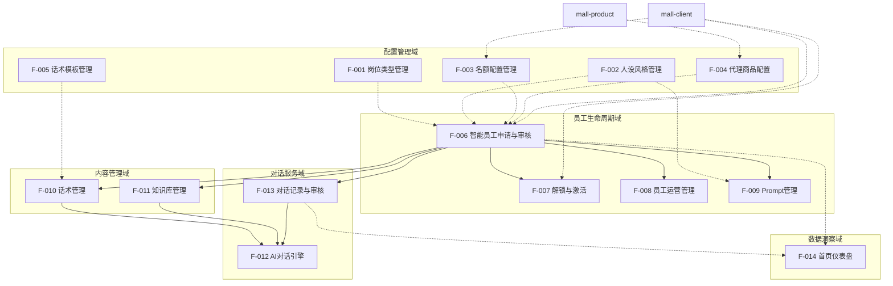

# 需求拆分报告: AI智能体代理平台

> 生成时间: 2026-03-15
> 基于流程: req-decomposition v1.0.0
> Program: P-2026-003-ai-agent-decomposition

---

## 1. 需求全景扫描

### 1.1 功能需求汇总

| 模块 | 功能点 | 优先级 | 涉及页面 |
|------|--------|--------|----------|
| **基础配置** | 岗位类型管理 | P0 | A-002, A-003 |
| | 人设风格管理 | P0 | A-016 |
| | 名额配置管理 | P0 | A-004 |
| | 代理商品配置 | P0 | A-005 |
| | 话术模板管理 | P1 | A-015 |
| **员工生命周期** | 智能员工申请 | P0 | U-001, U-002, U-002.5 |
| | 智能员工审核 | P0 | A-006, A-007 |
| | 解锁与激活 | P0 | U-003, C-006, A-017 |
| | 员工运营管理 | P0 | A-008, A-009, A-010 |
| **内容管理** | 话术管理 | P1 | U-007, U-008, A-011, A-012 |
| | 知识库管理 | P1 | U-009, U-010, A-013, A-014 |
| | 对话记录审核 | P1 | U-005, U-006, A-011 |
| **对话服务** | AI对话引擎 | P0 | C-001, C-002, C-003 |
| | 评分与举报 | P1 | C-004, C-005 |
| **数据洞察** | 首页仪表盘 | P1 | A-001 |

### 1.2 非功能需求

| 类型 | 需求 | 指标 |
|------|------|------|
| 性能 | 对话首字响应 | ≤2s |
| | 后台列表查询 | ≤1s |
| 可用性 | 对话服务 | 99.9% |
| | 管理后台 | 99.5% |
| 兼容性 | C端App | iOS 12+, Android 8+ |
| | 管理后台 | Chrome/Edge/Safari最新两版本 |

---

## 2. 业务域划分

基于业务边界和服务职责，划分为5大业务域：

| 业务域 | 对应服务 | 包含Feature | 职责描述 |
|--------|----------|-------------|----------|
| **配置管理域** | mall-admin(facade)<br>mall-agent-employee-service(application) | F-001~F-005 | 平台基础配置：岗位、风格、名额、商品池、话术模板 |
| **员工生命周期域** | mall-admin(facade)<br>mall-toc-service(facade)<br>mall-agent-employee-service(application) | F-006~F-009 | 员工全生命周期：申请、审核、解锁、激活、运营、Prompt |
| **内容管理域** | mall-admin(facade)<br>mall-toc-service(facade)<br>mall-agent-employee-service(application) | F-010~F-011 | 员工内容配置：话术、知识库及其审核 |
| **对话服务域** | mall-ai(facade)<br>mall-toc-service(facade)<br>mall-agent-employee-service(application) | F-012~F-013 | AI对话服务：对话引擎、记录、评分举报、审核 |
| **数据洞察域** | mall-admin(facade)<br>mall-agent-employee-service(application) | F-014 | 数据统计：首页仪表盘 |

---

## 3. 需求树

```yaml
# 可信源 - 需求结构定义
requirements:
  - id: F-001
    name: 岗位类型管理
    domain: 配置管理域
    module: mall-agent-employee-service
    type: functional
    priority: P0
    dependencies: []
    description: 运营人员管理智能员工岗位类型，支持增删改查及启用禁用
    acceptance_criteria:
      - 支持岗位CRUD操作
      - 返回该岗位下关联员工数
      - 启用/禁用状态正确联动
      - 接口返回符合CommonResult规范
    services:
      - name: mall-admin
        layer: facade
        interfaces: 4
      - name: mall-agent-employee-service
        layer: application
    tables:
      - aim_agent_job_type

  - id: F-002
    name: 人设风格管理
    domain: 配置管理域
    module: mall-agent-employee-service
    type: functional
    priority: P0
    dependencies: []
    description: 运营人员管理智能员工人设风格，支持增删改查及排序
    acceptance_criteria:
      - 支持风格CRUD及排序
      - 包含图标、名称、描述、Prompt预览字段
      - 支持启用/禁用，禁用后用户端不可选择
      - 用户端返回已启用风格列表
    services:
      - name: mall-admin
        layer: facade
        interfaces: 5
      - name: mall-toc-service
        layer: facade
        interfaces: 1
      - name: mall-agent-employee-service
        layer: application
    tables:
      - aim_agent_style_config

  - id: F-003
    name: 名额配置管理
    domain: 配置管理域
    module: mall-agent-employee-service
    type: functional
    priority: P0
    dependencies: []
    description: 运营人员配置不同用户等级的初始名额、销售额解锁规则、解锁人数
    acceptance_criteria:
      - 配置A/B/C/D/E五级用户初始名额
      - 配置销售额解锁规则（多级阈值）
      - 配置解锁上限（默认500万）
      - 配置解锁所需邀请人数（默认3人，范围1-10）
      - 用户申请时自动校验名额是否充足
      - 封禁时自动释放名额
    services:
      - name: mall-admin
        layer: facade
        interfaces: 2
      - name: mall-toc-service
        layer: facade
        interfaces: 1
      - name: mall-agent-employee-service
        layer: application
      - name: mall-client
        layer: data
    tables:
      - aim_agent_configs
      - aim_agent_user_quota
    dependencies_external:
      - mall-client（用户等级查询）

  - id: F-004
    name: 代理商品配置
    domain: 配置管理域
    module: mall-agent-employee-service
    type: functional
    priority: P0
    dependencies: []
    description: 运营人员配置可供用户申请代理的商品池，支持Excel批量导入
    acceptance_criteria:
      - 支持Excel批量导入，校验商品在商品库是否存在
      - 批量导入全部成功返回JSON；有失败行返回xlsx文件流
      - 移除前校验agent_status=0（未代理）
      - aim_agent_product.agent_status为聚合状态
      - 提供checkSpuAgented Inner API供申请时校验
      - 用户端按后台类目分页搜索仅返回agent_status=0商品
    services:
      - name: mall-admin
        layer: facade
        interfaces: 5
      - name: mall-toc-service
        layer: facade
        interfaces: 2
      - name: mall-agent-employee-service
        layer: application
      - name: mall-product
        layer: data
    tables:
      - aim_agent_product
    dependencies_external:
      - mall-product（商品校验、类目查询）

  - id: F-005
    name: 话术模板管理
    domain: 配置管理域
    module: mall-agent-employee-service
    type: functional
    priority: P1
    dependencies: []
    description: 运营人员维护话术模板库，用户创建智能员工时可一键引用模板
    acceptance_criteria:
      - 支持模板CRUD、启用/禁用
      - 字段包含触发条件、话术内容（≤500字）、适用岗位
      - 支持Excel批量导入模板
      - 应用层提供按岗位类型查询全量启用模板的内部方法
    services:
      - name: mall-admin
        layer: facade
        interfaces: 5
      - name: mall-agent-employee-service
        layer: application
    tables:
      - aim_agent_script_template

  - id: F-006
    name: 智能员工申请与审核
    domain: 员工生命周期域
    module: mall-agent-employee-service
    type: functional
    priority: P0
    dependencies:
      - F-001
      - F-002
      - F-003
      - F-004
    description: 用户提交智能员工申请，运营人员审核（通过/驳回+原因）
    acceptance_criteria:
      - 申请时校验用户名额是否充足
      - 申请时校验商品是否已被代理
      - 生成员工编号（格式如AIM001）
      - 申请表单支持社交平台链接文本输入+截图图片上传
      - 驳回时必须填写驳回原因，支持预设快捷选项
      - 驳回原因同步展示到用户端待审核页
      - 审核通过后状态流转为"待解锁"
    services:
      - name: mall-toc-service
        layer: facade
        interfaces: 4
      - name: mall-admin
        layer: facade
        interfaces: 4
      - name: mall-agent-employee-service
        layer: application
      - name: mall-client
        layer: data
    tables:
      - aim_agent_employee

  - id: F-007
    name: 智能员工解锁与激活
    domain: 员工生命周期域
    module: mall-agent-employee-service
    type: functional
    priority: P0
    dependencies:
      - F-006
    description: 审核通过后用户分享邀请链接，好友注册后计入解锁进度
    acceptance_criteria:
      - 解锁人数默认3人，后台可配置（1-10）
      - 好友通过链接注册后自动计入解锁进度
      - 防止同一用户对同一员工重复激活
      - 达到解锁人数后自动触发智能体生成并上线
      - 手动激活时邀请者固定为"系统"
      - 落地页展示员工编号、名称、风格、岗位、关联商品
    services:
      - name: mall-toc-service
        layer: facade
        interfaces: 4
      - name: mall-admin
        layer: facade
        interfaces: 2
      - name: mall-agent-employee-service
        layer: application
      - name: mall-client
        layer: data
    tables:
      - aim_agent_activation_record

  - id: F-008
    name: 智能员工运营管理
    domain: 员工生命周期域
    module: mall-agent-employee-service
    type: functional
    priority: P0
    dependencies:
      - F-006
    description: 运营人员管理所有智能员工，支持状态变更操作
    acceptance_criteria:
      - 支持按状态、岗位、用户等维度筛选员工
      - 返回咨询量、调用量、转化率、累计收益等业务数据
      - 封禁时自动释放SPU绑定和名额占用（不可逆）
      - 警告操作发送APP推送+站内信
      - 用户下线操作校验本人权限
    services:
      - name: mall-admin
        layer: facade
        interfaces: 7
      - name: mall-toc-service
        layer: facade
        interfaces: 2
      - name: mall-agent-employee-service
        layer: application
    tables:
      - aim_agent_employee

  - id: F-009
    name: Prompt管理与生成
    domain: 员工生命周期域
    module: mall-agent-employee-service
    type: functional
    priority: P0
    dependencies:
      - F-006
      - F-002
    description: 系统根据员工配置动态生成Prompt，运营人员可直接编辑
    acceptance_criteria:
      - 根据员工岗位/风格/商品信息自动选择模板并完成变量替换
      - 变量包含：员工名称、风格、商品名称、价格、特点、知识库片段、对话历史
      - 运营可直接编辑最终Prompt，用户不可见
      - Prompt编辑页提供「选择模板」下拉
      - 审核详情页展示Prompt预览
      - 沙盒模式下申请者可体验对话
    services:
      - name: mall-admin
        layer: facade
        interfaces: 3
      - name: mall-toc-service
        layer: facade
        interfaces: 1
      - name: mall-agent-employee-service
        layer: application
    tables:
      - aim_agent_employee
      - aim_agent_style_config

  - id: F-010
    name: 话术管理与审核
    domain: 内容管理域
    module: mall-agent-employee-service
    type: functional
    priority: P1
    dependencies:
      - F-006
    description: 用户为智能员工配置自定义话术，提交后进入审核流程
    acceptance_criteria:
      - 用户提交话术后状态为"待审核"，审核通过后生效
      - 展示话术与现有库的相似度，相似度>60%高亮警告
      - 支持批量通过操作
      - AI对话时优先匹配话术库，相似度≥0.85则命中直接返回
    services:
      - name: mall-toc-service
        layer: facade
        interfaces: 4
      - name: mall-admin
        layer: facade
        interfaces: 4
      - name: mall-agent-employee-service
        layer: application
    tables:
      - aim_agent_employee_script

  - id: F-011
    name: 知识库管理与审核
    domain: 内容管理域
    module: mall-agent-employee-service
    type: functional
    priority: P1
    dependencies:
      - F-006
    description: 用户为智能员工上传知识库文件，系统解析向量化
    acceptance_criteria:
      - 支持PDF/DOCX/TXT/MD格式，单文件≤10MB
      - 文件上传后自动触发解析，记录切片数量和解析状态
      - 解析状态：解析中/X切片（成功）/解析失败
      - 审核通过后文件内容向量化存入Milvus
      - AI对话时检索Top3相关知识片段
    services:
      - name: mall-toc-service
        layer: facade
        interfaces: 3
      - name: mall-admin
        layer: facade
        interfaces: 4
      - name: mall-agent-employee-service
        layer: application
    tables:
      - aim_agent_knowledge_file
    dependencies_external:
      - Milvus向量数据库
      - text-embedding-v2 Embedding服务

  - id: F-012
    name: AI对话引擎
    domain: 对话服务域
    module: mall-agent-employee-service
    type: functional
    priority: P0
    dependencies:
      - F-006
      - F-009
      - F-010
      - F-011
      - F-013
    description: 消费者与智能员工进行实时SSE流式对话
    acceptance_criteria:
      - 商品详情页按需展示AI导购悬浮按钮
      - SSE流式输出，首字响应≤2s
      - 话术优先：相似度≥0.85命中后直接返回
      - 未命中话术时检索知识库Top3片段注入Prompt
      - 回复消息标记来源（话术/AI生成，仅后台可见）
      - 对话内容完整记录
    services:
      - name: mall-toc-service
        layer: facade
        interfaces: 1
      - name: mall-ai
        layer: facade
        interfaces: 1
      - name: mall-agent-employee-service
        layer: application
    tables:
      - aim_agent_employee
      - aim_conversation
      - aim_conversation_message
    dependencies_external:
      - 通义千问qwen-turbo

  - id: F-013
    name: 对话记录与内容审核
    domain: 对话服务域
    module: mall-agent-employee-service
    type: functional
    priority: P1
    dependencies:
      - F-006
      - F-012
    description: 保存并查询对话记录，用户可评分和举报，运营人员审核
    acceptance_criteria:
      - 完整记录对话内容（含消息来源标记）
      - 用户可在对话结束后或主动评分，支持快捷标签
      - 举报支持虚假信息/违规内容/服务态度差/其他分类
      - 后台展示举报标记（红色高亮），支持仅看举报筛选
      - 运营可标记违规并关联员工处罚操作
    services:
      - name: mall-toc-service
        layer: facade
        interfaces: 3
      - name: mall-admin
        layer: facade
        interfaces: 3
      - name: mall-agent-employee-service
        layer: application
    tables:
      - aim_conversation
      - aim_conversation_message
      - aim_conversation_report

  - id: F-014
    name: 首页仪表盘
    domain: 数据洞察域
    module: mall-agent-employee-service
    type: functional
    priority: P1
    dependencies:
      - F-006
      - F-013
    description: 管理后台首页核心指标统计和趋势图表
    acceptance_criteria:
      - 统计智能员工总数（排除已封禁）、已上线员工数
      - 统计今日咨询量、今日成交额
      - 统计待审核数量（员工+话术+知识库汇总）
      - 返回近7/30天员工增长、咨询量、成交额趋势数据
    services:
      - name: mall-admin
        layer: facade
        interfaces: 1
      - name: mall-agent-employee-service
        layer: application
    tables:
      - aim_agent_employee
      - aim_conversation
      - aim_agent_employee_script
      - aim_agent_knowledge_file
```

---

## 4. 依赖关系图



---

## 5. 批次执行计划

基于依赖优先原则，建议按以下批次执行：

### 第一批：基础配置（P0，无依赖）

| Feature | 名称 | 工期 | 前置依赖 |
|---------|------|------|----------|
| F-001 | 岗位类型管理 | 3d | - |
| F-002 | 人设风格管理 | 3d | - |
| F-004 | 代理商品配置 | 5d | - |

### 第二批：名额配置与模板（P0/P1）

| Feature | 名称 | 工期 | 前置依赖 |
|---------|------|------|----------|
| F-003 | 名额配置管理 | 4d | mall-client用户等级接口 |
| F-005 | 话术模板管理 | 3d | - |

### 第三批：员工申请与审核（核心业务P0）

| Feature | 名称 | 工期 | 前置依赖 |
|---------|------|------|----------|
| F-006 | 智能员工申请与审核 | 8d | F-001, F-002, F-003, F-004 |

### 第四批：员工生命周期扩展（P0）

| Feature | 名称 | 工期 | 前置依赖 |
|---------|------|------|----------|
| F-007 | 解锁与激活 | 5d | F-006 |
| F-008 | 员工运营管理 | 5d | F-006 |
| F-009 | Prompt管理与生成 | 4d | F-006, F-002 |

### 第五批：内容管理（P1）

| Feature | 名称 | 工期 | 前置依赖 |
|---------|------|------|----------|
| F-010 | 话术管理与审核 | 5d | F-006 |
| F-011 | 知识库管理与审核 | 6d | F-006 |

### 第六批：对话服务（P0/P1，最复杂）

| Feature | 名称 | 工期 | 前置依赖 |
|---------|------|------|----------|
| F-013 | 对话记录与内容审核 | 5d | F-006 |
| F-012 | AI对话引擎 | 10d | F-006, F-009, F-010, F-011, F-013 |

### 第七批：数据洞察（P1）

| Feature | 名称 | 工期 | 前置依赖 |
|---------|------|------|----------|
| F-014 | 首页仪表盘 | 3d | F-006, F-013 |

---

## 6. 关键决策记录

| 决策点 | 选择 | 理由 |
|--------|------|------|
| 拆分维度 | 按业务域聚合 | 与公司服务架构对齐，降低跨服务协调成本 |
| Feature粒度 | 中等粒度（5-15接口） | 平衡开发独立性与管理复杂度 |
| 服务分层 | 严格三层架构 | facade/application/data职责清晰 |
| 接口定义 | 集中维护在api_definitions | 便于跨服务协作和版本管理 |
| 数据表归属 | 按业务域归属到应用服务 | mall-agent-employee-service承载核心数据 |
| 依赖处理 | 强依赖前置，软依赖降级 | 确保核心链路可用性 |

---

## 7. 接口与数据汇总

### 7.1 服务接口统计

| 服务 | 层级 | 涉及Feature数 | 预估接口数 |
|------|------|---------------|------------|
| mall-admin | facade | 14 | 48 |
| mall-toc-service | facade | 11 | 22 |
| mall-ai | facade | 1 | 1 |
| mall-agent-employee-service | application | 14 | 内部实现 |
| mall-product | data | 1 | 按需扩展 |
| mall-client | data | 3 | 按需扩展 |

### 7.2 数据表汇总

| 表名 | 所属服务 | 设计于Feature | 用途 |
|------|----------|---------------|------|
| aim_agent_job_type | mall-agent-employee-service | F-001 | 岗位类型表 |
| aim_agent_style_config | mall-agent-employee-service | F-002 | 人设风格配置表 |
| aim_agent_configs | mall-agent-employee-service | F-003 | 全局通用配置表 |
| aim_agent_user_quota | mall-agent-employee-service | F-003 | 用户名额汇总表 |
| aim_agent_product | mall-agent-employee-service | F-004 | 代理商品池表 |
| aim_agent_script_template | mall-agent-employee-service | F-005 | 话术模板表 |
| aim_agent_employee | mall-agent-employee-service | F-006 | 智能员工表 |
| aim_agent_activation_record | mall-agent-employee-service | F-007 | 激活记录表 |
| aim_agent_employee_script | mall-agent-employee-service | F-010 | 话术表 |
| aim_agent_knowledge_file | mall-agent-employee-service | F-011 | 知识库文件表 |
| aim_conversation | mall-agent-employee-service | F-013 | 对话记录表 |
| aim_conversation_message | mall-agent-employee-service | F-013 | 对话消息表 |
| aim_conversation_report | mall-agent-employee-service | F-013 | 对话举报表 |

---

## 8. 完结检查清单

- [x] 所有PRD功能点已映射为Feature
- [x] 每个Feature已明确facade/application/data服务分层
- [x] 接口定义已集中维护在api_definitions格式
- [x] 数据表归属已明确，对应设计Feature
- [x] 依赖关系已分析（强依赖/软依赖分类）
- [x] 开发顺序已按依赖优先原则建议

---

*报告生成完成，可作为后续开发Program的可信源*
